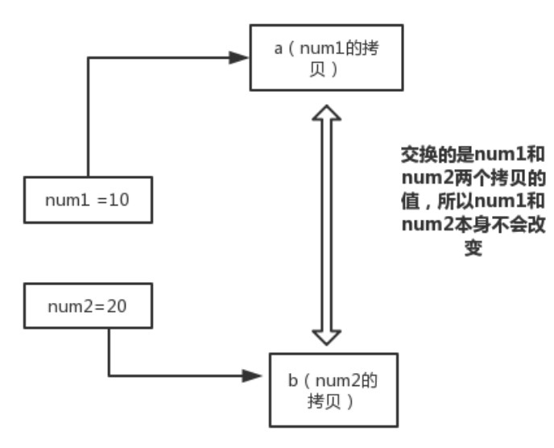
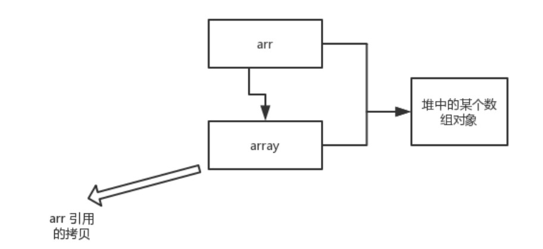
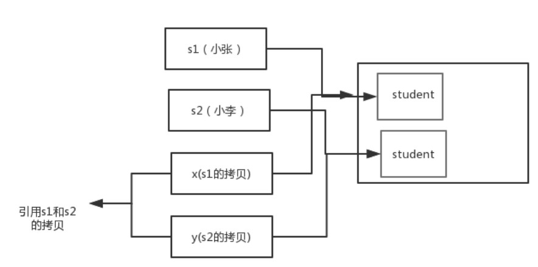
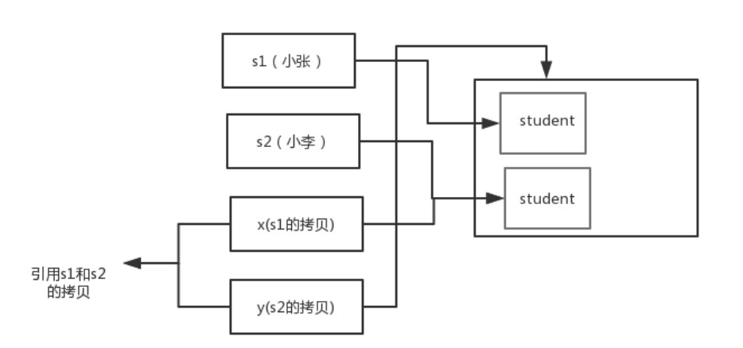
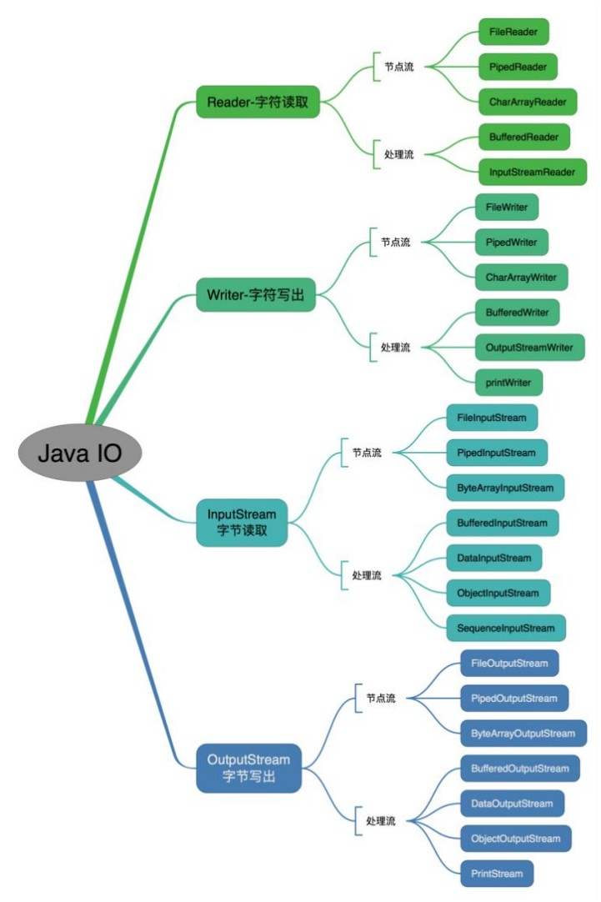
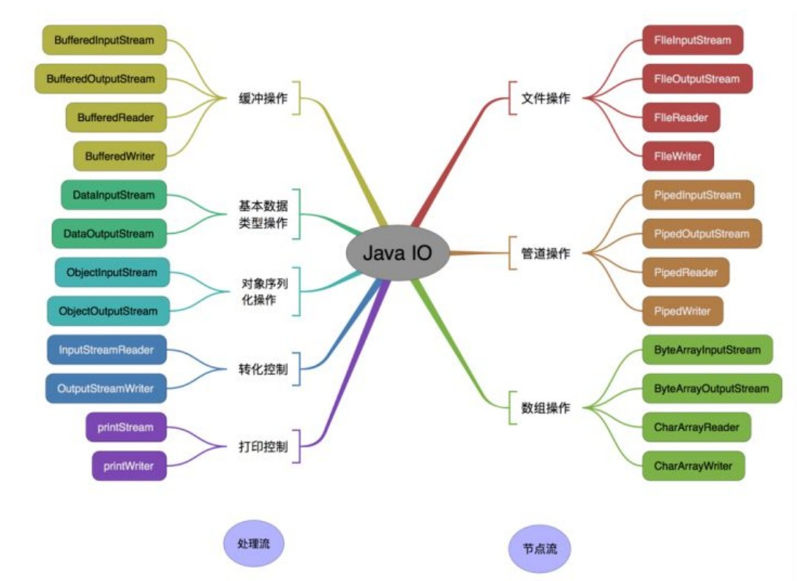

# 一、JAVA基础

1. **什么是编程？**

   编程就是让计算机为解决某个问题而使用某种程序设计语言编写程序代码，并最终得到结果的过程。

   为了使计算机能够理解人的意图，人类就必须要将解决问题的思路、方法、和手段通过计算机能够理解的方式告诉计算机，使得计算机能够根据人的指令一步一步去工作，完成某种特定的任务。这种人和计算机之间的交流的过程就是编程。

2. **什么是JAVA？**

   Java 是一门面向对象编程语言，不仅吸收了C++语言的各种优点，还摒弃了C++里难以理解的多继承、指针等概念，因此Java语言具有功能强大和简单易用两个特征。Java语言作为静态面向对象编程语言的代表，极好地实现了面向对象理论，允许程序员以优雅的思维方式进行复杂的编程。

3. **JVM、JDK 和 JRE 的关系？**

   - JVM：Java Virtual Machine 是 Java 虚拟机，Java 程序需要运行在虚拟机上，不同的平台有自己的虚拟机，因此 Java 语言可以实现跨平台
   - JDK：Java Development Kit 的简称，Java 开发工具包，提供了 Java 的开发环境和运行环境（JRE）。所以安装了JDK，就无需再单独安装JRE了。其中的开发工具：编译工具（javac.exe），打包工具（jar.exe）等
   - JRE：Java RunTime Environment的简称，java 运行环境，包括Java 虚拟机和 Java 程序所需的核心类库等。核心类库主要是java.lang包：包含了运行 Java 程序必不可少的类，如基本数据类型、基本数学函数、字符串处理、线程、异常处理类等，系统默认加载这个包

   具体来说，JDK 包含了 JRE ，同时还包含了编辑 java 源码的编译器 javac ，还包含了很多 java 程序调试和分析的工具。

   简单来说，如果你需要运行 java 程序，只需安装 JRE 就可以了，如果你需要编写 java 程序，需要安装 JDK 。

   JVM & JRE & JDK 关系图

   

4. **什么是跨平台性？原理是什么？**

   所谓跨平台性，是指java语言编写的程序，一次编译后，可以在多个系统平台上运行。

   实现原理：Java 程序是通过 java 虚拟机在系统平台上运行的，只要该系统可以安装相应的java虚拟机，该系统就可以运行Java程序。

5. **Java 语言有哪些特点？**

   - 简单易学（Java 语言的语法与C语言和C++语言很接近）
   - 面向对象（封装、继承、多态）
   - 平台无关性（Java 虚拟机实现平台无关性）
   - 支持网络编程并且很方便（Java 语言诞生本身就是为简化网络编程设计的）
   - 支持多线程（多线程机制使应用程序在同一时间并行执行多项任务）
   - 健壮性（Java 语言的强类型机制、异常处理、垃圾的自动收集等）
   - 安全性

6. **什么是字节码？采用字节码的最大好处是什么？**

   - 字节码：Java 源代码经过虚拟机编译器编译后产生的文件（即扩展为.class的文件），它不面向特定的处理器，只面向虚拟机。
   - 采用字节码的好处：Java语言通过字节码的方式，在一定程度上解决了传统解释型语言执行效率低的问题，同时又保留了解释型语言可移植的特点。所以Java程序运行时比较高效，并且，由于字节码并不转对一种特定的机器，因此，Java程序无需重新编译便可在不同的计算机上运行。
   - java 的编译器和解释器：Java中引入了虚拟机的概念，即在机器和编译程序之间加入了一层抽象的虚拟机器。这台虚拟的机器在任何平台上都提供给编译程序一个共同的接口。编译程序只需要面向虚拟机，生成虚拟机能够理解的代码，然后由解释器来将虚拟机代码转换为特定系统的机器码执行。在Java中，这种供虚拟机理解的代码叫做字节码（即扩展为.class的文件），它不面向任何特定的处理器，只面向虚拟机。每一种平台的解释器是不同的，但是实现的虚拟机是相同的。Java源程序经过编译器编译后变成字节码，字节码由虚拟机解释执行，虚拟机将每一条要执行的字节码送给解释器，解释器将其翻译成特定机器上的机器码，然后在特定的机器上运行，这就是上面提到的Java的特点和编译与解释并存的道理。

   > Java 源代码 --> 编译器 --> jvm可执行的Java字节码 （即虚拟指令  .class） --> jvm --> jvm中解释器 --> 机器可执行的二进制机器码 --> 程序运行

7. **什么是Java程序的主类？应用程序和小程序的主类有何不同？**

   一个程序中可以有多个类，但只能有一个类是主类。在Java应用程序中，这个主类是指包含main()方法的类。而在Java小程序中，这个主类是一个继承自系统类JApplet或Applet的子类。应用程序的主类不一定要求是public类，但小程序的主类要求必须是public类。主类是Java程序执行的入口点。

8. **Java应用程序与小程序之间有哪些差别？**

   简单说应用程序是从主线程启动（也就是main()方法）。applet小程序没有main方法，主要是嵌在浏览器页面上运行（调用init()线程或者run()来启动），嵌入浏览器这点跟flash的小游戏类似。

9. **Java和C++的区别？**

   - 都是面向对象的语言，都支持继承、封装和多态
   - Java不提供指针来直接访问内存，程序内存更加安全
   - Java的类是单继承的，C++支持多重继承；虽然Java的类不可以多继承，但是接口可以多实现。
   - Java有自动内存管理机制，不需要程序员手动释放无用内存。

10. **Oracle JDK 和 OpenJDK 的对比**

    1. Oracle JDK版本将每3年发布一次，而 OpenJDK 版本每3个月发布一次；
    2. OpenJDK 是一个参考模型并且是完全开源的，而 Oracle JDK 是 OpenJDK 的一个实现，并不是完全开源的。
    3. Oracle JDK 比 OpenJDK 更稳定。OpenJDK 和 Oracle JDK的代码几乎相同，但 Oracle JDK有更多的类和一些错误修复。因此，如果你想开发企业/商业软件，建议选择Oracle JDK，因为它经过了彻底的测试和稳定。某些情况下，有些人提到在使用 OpenJDK 可能会遇到了许多应用程序崩溃的问题，但是，只需切换到 Oracle JDK 就可以解决问题。
    4. 在响应性和 JVM 性能方面， Oracle JDK 与 OpenJDK 相比提供了更好的性能。
    5. Oracle JDK 不会为即将发布的版本提供长期支持，用户每次都必须通过更新到最新版本获得支持来获取最新版本。
    6. Oracle JDK 根据二进制代码许可协议获得许可，而 OpenJDK 根据 GPL V2许可获得许可。

11. **Java 有哪些数据类型**

    Java 语言是强类型语言，对于每一种数据都定义了明确的具体的数据类型，在内存中分配了不同大小的内存空间。

    分类：

    - 基本数据类型
      - 数值型
        - 整数类型（byte，short，int，long）
        - 浮点类型（float，double）
      - 字符型（char）
      - 布尔型（boolean）
    - 引用数据类型
      - 类（class）
      - 接口（interface）
      - 数组（[]）

    Java基本数据类型图

    |  类型  |   类型名称   | 关键字  | 占用内存 |                           取值范围                           | 作为成员变量默认值 |
    | :----: | :----------: | :-----: | :------: | :----------------------------------------------------------: | :----------------: |
    |  整形  |    字节型    |  byte   |  1字节   |                 -128（-2^7）~ 127（2^7 - 1）                 |         0          |
    |        |    短整型    |  short  |  2字节   |            -32768（-2^15） ~ 32767（2 ^ 15 - 1）             |         0          |
    |        |     整型     |   int   |  4字节   |         -2147483648（-2^31）~ 2147483647（2^31 - 1）         |         0          |
    |        |    长整型    |  long   |  8字节   | -9223372036854775808（-2^63）~ 9223372036854775807（2^63-1） |         0L         |
    | 浮点型 | 单精度浮点型 |  float  |  4字节   |                     -3.403E38 ~ 3.403E38                     |        0.0F        |
    |        | 双精度浮点型 | double  |  8字节   |                    -1.798E308 ~ 1.798E308                    |        0.0D        |
    | 字符型 |    字符型    |  char   |  2字节   |              表示一个字符，如（'a'，'A'，'家'）              |      '\u0000'      |
    | 布尔型 |    布尔型    | boolean |  1字节   |                  只有两个值，true 或 false                   |       false        |

12. **swtich 是否能作用在 byte 上，是否能作用在 long 上，是否能作用在 String 上**

    在 Java 5 以前，switch(expr) 中，expr 只能是 byte、short、char、int。从 Java 5 开始，Java中引入了枚举类型，expr 也可以是 enum 类型，从 Java 7开始，expr 还可以是字符串（String），但是长整型long在目前所有的版本中都是不可以的。

13. **用最有效的方法计算 2 乘以 8**

    2 << 3（左移 3 位相当于乘以 2 的 3 次方，右移 3 位相当于除以 2 的 3 次方）

14. **float f = 3.4; 是否正确**

    不正确。3.4 是双精度数，将双精度型 （double）赋值给浮点数（float）属于下转型（down-casting，也称为窄化）会造成精度损失，因此需要强制类型转换float f = (float) 3.4；或者写成 float f = 3.4F；

15. **short s1 = 1; s1 = s1 + 1; 有错吗？short s1 = 1; s1 += 1; 有错吗？**

    - 第一项，由于 1 是 int 类型，因此 s1 + 1 运算结果也是 int 型，需要强制转换类型才能赋值给 short 型。
    - 第二项，可以正确编译，因为 s1 += 1；相当于 s1 = (short(s1 + 1))；其中有隐含的强制类型转换。

16. **Java 语言采用何种编码方案？有何特点？**

    Java 语言采用 Unicode 编码标准，Unicode（标准码），它为每个字符制定了一个唯一的数值，因此在任何的语言，平台，程序都可以放心的使用。

17. **什么是Java注释**

    - 定义：用于解释说明程序的文字

    - 分类

      - 单行注释

        格式：// 注释文字

      - 多行注释

        格式：/* 注释文字 */

      - 文档注释

        格式：/** 注释文字 */

    - 作用

      在程序中，尤其是复杂的程序中，适当的加入注释可以增加程序的可读性，有利于程序的修改、调试和交流。注释的内容在程序编译的时候会被忽视，不会产生目标代码，注释的部分不会对程序的执行结果产生任何影响。

      注：多行和文档注释都不能嵌套使用

18. **访问修饰符 public，private，protected，以及不写（默认）时的区别**

    - 定义：Java中，可以使用访问修饰符来保护对类、变量、方法和构造方法的访问。Java支持4种不同的访问权限。

    - 分类
      - private：在同一类可见。使用对象：变量、方法。注意：不能修饰类（外部类）
      - default：即默认，什么也不写，不使用任何关键字。在同一包内可见，不使用任何修饰符。适用对象：类、接口、变量、方法。
      - protected：对同一包内的类和所有子类可见。使用对象：变量、方法。注意：不能修饰类（外部类）
      - public：对所有类可见。使用对象：类、接口、变量、方法。

    - 访问修饰符图

      |  修饰符   | 当前类 | 同包 | 子类 | 其他包 |
      | :-------: | :----: | :--: | :--: | :----: |
      |  private  |   √    |  ×   |  ×   |   ×    |
      |  default  |   √    |  √   |  ×   |   ×    |
      | protected |   √    |  √   |  √   |   ×    |
      |  public   |   √    |  √   |  √   |   √    |

19. **& 和 && 的区别**

    & 运算符有两种用法：1. 按位与；2. 逻辑与

    && 运算符是短路与运算。逻辑与跟短路与的差别是非常巨大的，虽然两者都要求运算符左右两端的布尔值都是 true 整个表达式的值才是 true。&& 之所以称为短路运算，是因为如果 && 左边的表达式的值是 false，右边的表达式会被直接短路掉，不会进行运算。

    注意：逻辑或运算符（|）和短路运算符（||）的差别也是如此。

20. **Java 有没有 goto**

    goto 是 Java 中的保留字，在目前版本的Java中没有使用。

21. **final、finally、finalize 有什么区别？**

    - final 可以修饰类、变量、方法，修饰类表示该类不能被继承、修饰方法表示该方法不能被重写、修饰变量表示该变量是一个常量不能被重新赋值。
    - finally 一般作用在 try-catch 代码块中，在处理异常的时候，通常我们将一定要执行的代码放在finally代码块中，表示不管是否出现异常，该代码块都会执行，一般用来存放一些关闭资源的代码。
    - finalize 是一个方法，属于 Object 类的一个方法，而 Object 类是所有类的父类，该方法一般由垃圾回收器来调用，当我们调用 System 的 gc() 方法的时候，由垃圾回收器调用 finalize()，回收垃圾，一个对象是否可回收的最后判断。

22. **this 关键字的用法**

    this 是自身的一个对象，代表对象本身，可以理解为：指向对象本身的一个指针。

    this 的用法在 java 中大体可以分为 3 种：

    1. 普通的直接引用，this 相当于是指向当前对象本身。

    2. 形参与成员名字重名，用 this 来区分：

       ```java
       public Person(String name, int age) {
           this.name = name;
           this.age = age;
       }
       ```

    3. 引用本类的构造函数

       ```java
       class Person {
           private String name;
           private int age;
           
           public Person() {
               
           }
           
           public Person(String name) {
               this.name = name;
           }
           
           public Person(String name, int age) {
               this(name);
               this.age = age;
           }
       }
       ```

23. **super 关键字的用法**

    super 可以理解为式指向自己超类对象的一个指针，而这个超类指的是离自己最近的一个父类。

    super 也有 3 种用法：

    1. 普通的直接引用

       与 this 类似，super 相当于是指向当前对象的父类的引用，这样就可以用super.xxx来引用父类的成员。

    2. 子类中的成员变量或方法与父类中的成员变量或方法同名时，用super进行区分

       ```java
       class Person {
       	protected String name;
           
       	public Person(String name) {
       		this.name = name;
       	}
       }
       
       class Student extends Person{
       	private String name;
       	public Student(String name, String name1) {
       		super(name);
       		this.name = name1;
       	}
       	public void getInfo(){
       		System.out.println(this.name); //Child
       		System.out.println(super.name); //Father
       	}
       
       }
       public class Test {
       	public static void main(String[] args) {
       		Student s1 = new Student("Father","Child");
       		s1.getInfo();
       	}
       }
       ```

    3. 引用父类构造函数
       - super(参数)：调用父类中的某一个构造函数（应该为构造函数中的第一条语句）
       - this(参数)：调用本类中另一种形式的构造函数（应该为构造函数中的第一条语句）

24. **this 与 super 的区别**

    - super：它引用当前对象的直接父类中的成员（用来访问直接父类中被隐藏的父类中成员数据或函数，基类与派生类中有相同成员定义时如：super.变量名 super.成员函数名(实参)
    - this：它代表当前对象名（在程序中易产生二义性之处，应使用 this 来指明当前对象；如果函数的形参与类中的成员数据同名，这时需用 this 来指明成员变量名）
    - super() 和 this() 类似，区别是，super() 在子类中调用父类的构造方法，this() 在本类中调用本类其他构造方法。
    - super() 和 this() 均需放在构造方法内第一行。
    - 尽管可以用 this 调用一个构造器，但却不能调用2个。
    - this 和 super 不能同时出现在一个构造函数里面，因为 this 必然会调用其它的构造函数，其它的构造函数必然也会有 super 语句的存在，所以在同一个构造函数里面有相同的语句，就失去了语句的意义，编译器也不会通过。
    - this() 和 super() 都指的是对象，所以，均不可以在 static 环境中使用，包括：static 变量，static 方法，static 语句块。
    - 从本质上讲，this 是一个指向本对象的指针，然后 super 是一个 Java 关键字。

25. **static 存在的意义**

    static 的主要意义是在于创建独立于具体对象的域变量或者方法。以致于即使没有创建对象，也能使用属性和调用方法。

    static 关键字还有一个比较关键的作用是，用来形成静态代码块以优化程序性能。static 块可以置于类中的任何地方，类中可以有多个 static 块。在类初次被加载的时候，会按照 static 块的顺序来执行每个 static 块，并且只会执行一次。

    由于 static 块只会在类加载的时候执行一次，所以可以用来优化程序性能。因此，很多时候会将一些只需要进行一次的初始化操作都放在 static 代码块中进行。

26. **static 的独特之处**

    - 被 static 修饰的变量或者方法是独立于该类的任何对象，也就是说，这些变量和方法不属于任何一个实例对象，而是被类的实例对象所共享。

      > 就是说，一个类的静态成员，他是属于大伙的（即这个类的多个对象实例），所有的类对象共享的，不像成员变量是自己的

    - 在该类被第一次加载的时候，就会去加载被 static 修饰的部分，而且只在类第一次使用时加载并进行初始化，注意这是第一次用就要初始化，后面根据需要是可以再次赋值的。

    - static 变量值在类加载的时候分配空间，以后创建类对象的时候不会重新分配。赋值的话，是可以任意赋值的。

    - 被 static 修饰的变量或者方法是优先于对象存在的，也就是说当一个类加载完毕之后，即使没有创建对象，也可以去访问。

27. **static 应用场景**

    因为 static 是被类的实例对象所共享，因此如果某个成员变量是被所有对象所共享的，那个这个成员变量就应该被定义为静态变量。

    因此比较常见的 static 应用场景有：

    1. 修饰成员变量
    2. 修饰成员方法
    3. 静态代码块
    4. 修饰类（只能修饰内部类也就是静态内部类）
    5. 静态导包

28. **static 注意事项**

    - 静态只能访问静态
    - 非静态可以访问非静态的，也可以访问静态的

29. **break，continue，return 的区别及作用**

    break 跳出总上一层循环，不再执行循环（结束当前循环体）

    continue 跳出本次循环，继续执行下次循环（结束正在执行的循环 进入下一个循环条件）

    return 程序返回，不再执行下面的代码（结束当前方法，直接返回）

30. **如何跳出当前的多重嵌套循环**

    可以在外面的循环语句前定义一个标号，然后在里层循环体的代码中使用带有标号的break语句，即可跳出外层循环。

    ```java
    public static void main(String[] args) {
    	ok:
        for (int i = 0; i < 10; i++) {
    		for (int j = 0; j < 10; j++) {
    			System.out.println("i=" + i + ",j=" + j);
                if (j == 5) {
                    break ok;
                }
            }
        }
    }
    ```

31. **面向对象与面向过程的区别**

    - 面向过程：
      - 优点：性能比面向对象高，因为类调用时需要实例化，开销比较大，比较消耗资源；比如单片机、嵌入式开发、Linux/Unix 等一般采用面向过程开发，性能是最重要的因素。
      - 缺点：没有面向对象易维护、易复用、易扩展
    - 面向对象：
      - 优点：易维护、易复用、易扩展，由于面向对象有继承、封装、多态的特性，可以设计出低耦合的系统，使系统更加灵活、更加易于维护
      - 缺点：性能比面向过程低

    面向过程是具体化的，流程化的，解决一个问题，你需要一步一步的分析，一步一步的实现。

    面向对象是模型化的，你只需抽象出一个类，这是一个封闭的盒子，在这里你拥有数据也拥有解决问题的方法。需要什么功能直接使用就可以了，不必去一步一步的实现，至于这个功能是如何实现的，不需要关注。

    面向对象的底层其实还是面向过程，把面向过程抽象成类，然后封装，方便我们使用的就是面向对象了。

32. **面向对象的特征有哪些方面**

    - 抽象：抽象是将一类对象的共同特征总结出来构造类的过程，包括数据抽象和行为抽象两方面。抽象只关注对象有哪些属性和行为，并不关注这些行为的细节是什么。

    - 封装：封装把一个对象的属性私有化，同时提供一些可以被外界访问的属性和方法，也可设置属性不想被外界访问。但是如果一个类没有提供给外界访问的方法，那么这个类也没有什么意义了。

      隐藏对象的属性和实现细节，仅对外提供公共访问方式，将变化隔离，便于使用，提高复用性和安全性。

    - 继承：继承是使用已存在的类的定义作为基础建立新类的技术，新类的定义可以增加新的数据或新的功能，也可以用父类的功能，但不能选择性的继承父类。通过使用继承我们能够非常方便的复用以前的代码。

      关于继承需要注意的是：

      - 子类拥有父类的非 private 的属性和方法。
      - 子类可以拥有自己的属性和方法，即子类可以对父类进行扩展
      - 子类可以用自己的方式实现父类的方法。

      继承是多态的前提

    - 多态：多态就是指程序中定义的引用变量所指向的具体类型和通过该引用变量发出的方法调用在编程时并不确定，而是在程序运行期间才确定，即一个引用变量到底会指向哪个类的实例对象，该引用变量发出的方法调用到底是哪个类中实现的方法，必须在由程序运行期间才能决定。

      父类或接口定义的引用变量可以指向子类或具体实现类的实例对象。提高了程序的扩展性。

      在 Java 中有两种形式可以实现多态：继承（多个子类对同一方法的重写）和接口（实现接口并覆盖接口中同一方法）

      方法重载（overload）实现的是编译时的多态性（也称为前绑定），而方法重写（实现的是）运行时的多态性（也称为后绑定）

      一个引用变量到底会指向哪个类的实例对象，该引用变量发出的方法调用到底是哪个类中实现的方法，必须由程序运行期间才能决定。运行时的多态是面向对象最精髓的东西，要实现多态需要做两件事：

      - 方法重写（子类继承父类并重写父类中已有的或抽象的方法）
      - 对象造型（用父类型引用子类型对象，这样同样的引用调用同样的方法就会根据子类对象的不同而表现出不同的行为）

33. **什么是多态机制？Java 语言时如何实现多态的**

    - 多态就是指程序中定义的引用变量所指向的具体类型和通过该引用变量发出的方法调用在编程时并不确定，而是在程序运行期间才确定，即一个引用变量到底会指向哪个类的实例对象，该引用变量发出的方法调用到底是哪个类中实现的方法，必须在由程序运行期间才能决定。因为在程序运行时才确定具体的类，这样，不用修改源程序代码，就可以让引用变量绑定到各种不同的类实现上，从而导致该引用调用的具体方法随之改变，即不修改程序代码就可以改变程序运行时所绑定的具体代码，让程序可以选择多个运行状态，这就是多态性。

      多态分为编译时多态和运行时多态。其中编译时多态是静态的，主要是指方法的重载，它是根据参数列表的不同来区分不同的函数，通过编译之后变为两个不同的函数，在运行时谈不上多态。而运行时多态是动态的，它是通过动态绑定来实现的，也就是我们所说的多态性。

    - 多态的实现

      Java 实现多态有三个必要条件：继承、重写、向上转型

      继承：在多态中必须存在有继承关系的子类和父类。

      重写：子类对父类中某些方法进行定义，在调用这些方法时就会调用子类的方法。

      向上转型：在多态中需要将子类的引用赋给父类对象，只有这样该引用才能够具备技能调用父类的方法和子类的方法。

      对于 Java 而言，它多态的实现机制遵循一个原则：当超类对象引用变量引用子类对象时，被引用对象的类型而不是引用变量的类型决定了调用谁的方法，但是这个被调用的方法必须是在超类中定义过的，也就是说被子类覆盖的方法。

34. **面向对象五大基本原则**

    - 单一职责原则 SRP（Single Responsibility Principle）类的功能要单一，不能包罗万象。
    - 开放封闭原则 OCP（Open - Close Principle）一个模块对于扩展是开放的，对于修改是封闭的。
    - 里式替换原则 LSP（the Liskov Substitution Principle LSP）子类可以替换父类出现在父类能够出现的任何地方。
    - 依赖倒置原则 DIP（the Dependency Inversion Principle DIP）高层次的模块不应该依赖于低层次的模块，他们都应该依赖于抽象。抽象不应该依赖于具体实现，具体实现应该依赖于抽象。
    - 接口分离原则 ISP（the Interface Segregation Principle ISP）设计时采用多个与特定客户类有关的接口比采用一个通用的接口更好。

35. **抽象类与接口的对比**

    抽象类是用来捕捉子类的通用特性的。接口是抽象方法的集合。

    从设计层面来说，抽象类是对类的抽象，是一种模板设计，接口是行为的抽象，是一种行为的规范。

    - 相同点

      - 接口和抽象类都不能实例化
      - 都位于继承的顶端，用于被其他实现或继承
      - 都包含抽象方法，其子类都必须重写这些抽象方法

    - 不同点

      |    参数    |                            抽象类                            |                             接口                             |
      | :--------: | :----------------------------------------------------------: | :----------------------------------------------------------: |
      |    声明    |                 抽象类使用abstract关键字声明                 |                 接口使用interface关键字声明                  |
      |    实现    | 子类用extends关键字继承抽象类。如子类不是抽象类，需要提供抽象类所有声明方法的实现 | 子类使用implents关键字来实现接口。需要提供接口所有声明的方法的实现 |
      |   构造器   |                      抽象类可以有构造器                      |                       接口不能有构造器                       |
      | 访问修饰符 |              抽象类中的方法可以是任意访问修饰符              | 接口方法默认修饰符是public，并且不允许定义为private或protected |
      |   多继承   |                 一个类最多只能继承一个抽象类                 |                    一个类可以实现多个接口                    |
      |  字段声明  |                 抽象类的字段声明是可以任意的                 |              接口的字段默认都是 static 和 final              |

    - 备注

      Java8 中接口引入了默认方法和静态方法，以此来减少抽象类和接口之间的差异

      可以为接口提供默认实现的方法，并且不用强制子类实现它

      接口和抽象类各有优缺点，在接口和抽象类的选择上，必须遵守这样一个规则

      - 行为模型应该总是通过接口而不是抽象类定义，所以通常是优先选用接口，尽量少用抽象类。
      - 选择抽象类的时候通常是如下情况：需要定义子类的行为，又要为子类提供通用的功能。

36. **普通类和抽象类的区别**

    - 普通类不能包含抽象方法，抽象类可以包含抽象方法
    - 抽象类不能直接实例化，普通类可以直接实例化

37. **抽象类能使用final修饰吗**

    不能，定义抽象类就是让其他类继承的，如果定义为 final 该类就不能被继承，这样彼此会产生矛盾。

38. **创建一个对象用什么关键字？对象实例与对象引用有何不同**

    new 关键字，new 创建对象实例（对象实例在内存中），对象引用指向对象实例（对象引用存放在栈内存中）。一个对象引用可以指向0个或1个对象（一根绳子可以不系气球，也可以系一个气球）；一个对象可以有 n 个引用指向它（可以用 n 条绳子系住一个气球）

39. **成员变量与局部变量的区别有哪些**

    变量：在程序执行的过程中，在某个范围内其值可以发生改变的量。从本质上讲，变量其实是内存中的一小块区域。

    成员变量：方法外部，类内部定义的变量

    局部变量：类的方法中的变量

    区别在于：

    |   区别   |                    成员变量                    |                           局部变量                           |
    | :------: | :--------------------------------------------: | :----------------------------------------------------------: |
    |  作用域  |                 针对整个类有效                 |       只在某个范围内有效（一般指的就是方法，语句体内）       |
    | 存储位置 | 随着对象的创建/消失而存在/消失，存储在堆内存中 | 在方法被调用，或者语句被执行的时候存在，存储在栈内存中。结束后自动释放 |
    | 生命周期 |         随着对象的创建/消失而存在/消失         |             当方法调用完，或语句结束后，自动释放             |
    |  初始值  |                  有默认初始值                  |                没有默认初始值，使用前必须赋值                |

    在使用变量遵循的原则：就近原则（首先在局部范围内找，有就使用；接着在成员为止找）

40. **在 Java 中定义一个不做事且没有参数的构造方法的作用**

    Java 程序在执行子类的构造方法之前，如果没有用 super() 来调用父类特定的构造方法，则会调用父类中“没有参数的构造方法”。因此，如果父类中只定义了有参数的构造方法，而在子类的构造方法中又没有用 super() 来调用父类中特定的构造方法，则编译时将发生错误，因为 Java 程序在父类找不到没有参数的构造方法可供执行。解决办法是在父类里加上一个不做事且没有参数的构造方法。

41. **在调用子类构造方法之前会先调用父类没有参数的构造方法，其目的是？**

    帮助子类做初始化工作

42. **一个类的构造方法的作用是什么？若一个类没有声明构造方法，该程序能正确执行吗？为什么？**

    主要工作是完成对类对象的初始化工作。

    可以执行，因为即使一个类没有声明构造方法，也会有默认的不带参数的构造方法。

43. **构造方法有哪些特性？**

    - 名字与类名相同
    - 没有返回值，但不能用 void 声明构造函数
    - 生成类的对象时自动执行，无需调用

44. **静态变量和实例变量的区别**

    - 静态变量：静态变量由于不属于任何实例对象，属于类的，所以在内存中只会有一份，在类的加载过程中，JVM 只为静态变量分配一次内存空间。
    - 实例变量：每次创建对象，都会为每个对象分配成员变量内存空间，实例变量是属于实例对象的，在内存中，创建几次对象，就有几份成员变量。

45. **静态变量与普通变量的区别**

    - static 变量也称作静态变量，静态变量与非静态变量的区别是：静态变量被所有的对象所共享，在内存中只有一个副本，它当且仅当在类初次加载时会被初始化。而非静态变量是对象所拥有的，在创建对象的时候被初始化，存在多个副本，各个对象拥有的副本互不影响。

    - static 成员变量的初始化顺序按照定义的顺序进行初始化

46. **静态方法与实例方法有何不同？**

    - 在外部调用静态方法时，可以使用“类名.方法名”的方式，也可以使用“对象名.方法名的方式”。而实例方法只有后面这种方式。也就是说，调用静态方法可以无需创建对象。
    - 静态方法在访问本类成员时，只允许访问静态成员（即静态成员变量和静态方法），而不允许访问实例成员变量和实例方法；实例方法则无此限制

47. **在一个静态方法内调用一个非静态成员为什么是非法的？**

    由于静态方法可以不通过对象进行调用，因此在静态方法里，不能调用其他非静态变量，也不可以访问非静态成员。

48. **什么是方法的返回值？返回值的作用是什么？**

    方法的返回值是指我们获取到的某个方法体中的代码执行后产生的结果（前提是该方法可能产生结果）

    返回值的作用：接收出结果，使得它可以用于其他的操作

49. **什么是内部类？**

    在 Java 中，可以将一个类的定义放在另外一个类的内部，这就是内部类。内部类本身就是类的一个属性，与其他属性定义方法一致

50. **内部类的分类有哪些**

    成员内部类、局部内部类、匿名内部类和静态内部类

    - 静态内部类：定义在类内部的静态类

      ```java
      public class Outer {
      	private static int radius = 1;
      	static class StaticInner {
      		public void visit() {
      			System.out.println("visit outer static variable:" + radius);
      		}
      	}
      }
      ```

      静态内部类可以访问外部类所有的静态变量，不能访问外部类的非静态变量；静态内部类的创建方式，**new 外部类.静态内部类()**，如下：

      ```java
      Outer.StaticInner inner = new Outer.StaticInner();
      inner.visit();
      ```

    - 成员内部类：定义在类内部，成员位置上的非静态类

      ```java
      public class Outer {
      	private static int radius = 1;
      	private int count =2;
          
      	class Inner {
      		public void visit() {
      			System.out.println("visit outer static variable:" + radius);
      			System.out.println("visit outer variable:" + count);
      		}
      	}
      }
      
      ```

      成员内部类可以访问外部类所有的变量和方法，包括静态和非静态，私有和公有。成员内部类依赖于外部类的实例，它的创建方式为

      **外部类实例.new 内部类()**，如下：

      ```java
      Outer outer = new Outer();
      Outer.Inner inner = outer.new Inner();
      inner.visit();
      ```

    - 局部内部类：定义在方法中的内部类，就是局部内部类

      ```java
      public class Outer {
      	private int out_a = 1;
      	private static int STATIC_b = 2;
          	
      	public void testFunctionClass(){
          	int inner_c =3;
      		class Inner {
      			private void fun(){
      				System.out.println(out_a);
      				System.out.println(STATIC_b);
      				System.out.println(inner_c);
      			}
      		}
      		Inner inner = new Inner();
      		inner.fun();
      	}
      	public static void testStaticFunctionClass(){
      		int d =3;
      		class Inner {
      			private void fun(){
      				// System.out.println(out_a); 编译错误，定义在静态方法中的局部类不可以访问外部类的实例变量
      				System.out.println(STATIC_b);
      				System.out.println(d);
      			}
      		}
      		Inner inner = new Inner();
      		inner.fun();
      	}
      }
      ```

      定义在实例方法中的局部类可以访问外部类的所有变量和方法，定义在静态方法中的局部类只能访问外部类的静态变量和方法。局部内部类的创建方式，在对应方法内，**new 内部类()**，如下：

      ```java
      public static void testStaticFunctionClass(){
      	class Inner {
      	}
      	Inner inner = new Inner();
      }
      ```

    - 匿名内部类：即没有名字的内部类

      ```java
      public class Outer {
          
              private void test(final int i) {
                  new Service() {
                      public void method() {
                          for (int j = 0; j < i; j++) {
                              System.out.println("匿名内部类" );
                          }
                      }
                  }.method();
              }
          //匿名内部类必须继承或实现一个已有的接口
          interface Service{
          void method();
          }
      }
      ```

      除了没有名字，匿名内部类还有以下特点：

      - 匿名内部类必须继承一个抽象类或者实现一个接口。
      - 匿名内部类不能定义任何静态成员和静态方法。
      - 当所在的方法的形参需要被匿名内部类使用时，必须声明为final。
      - 匿名内部类不是抽象的，它必须要实现继承的类或者实现的接口的所有抽象方法。

      匿名内部类创建方式：

      ```java
      new 类/接口 {
          // 匿名内部类的实现部分
      }
      ```

51. **内部类的优点**

    - 一个内部类对象可以访问创建它的外部类对象的内容，包括私有数据
    - 内部类不为同一包的其他类所见，具有很好的封装性。
    - 内部类有效实现了“多重继承”，优化 java 单继承的缺陷。
    - 匿名内部类可以很方便的定义回调。

52. **内部类有哪些应用场景**

    - 一些多算法结合
    - 解决一些非面向对象的语句块
    - 适当使用内部类，使代码更加灵活和富有扩展性
    - 当某个类除了它的外部类，不再被其他的类使用时

53. **局部内部类和匿名内部类访问局部变量的时候，为什么变量必须加上final**

    ```java
    public class Outer {
        
        void outMethod(){
            final int a =10;
            class Inner {
                void innerMethod(){
                    System.out.println(a);
                }
            }
        }
    }
    ```

    局部变量直接存储在栈中，当方法执行结束后，非final的局部变量就会被销毁。而局部内部类对局部变量的引用依然存在，如果局部内部类要调用局部变量时，就会出错。加了 final，可以确保局部内部类使用的变量与外层的局部变量区分开，解决了这个问题。

54. **看程序说运行结果**

    ```java
    public class Outer {
    	private int age = 12;
        
    	class Inner {
    		private int age = 13;
    		public void print() {
    			int age = 14;
    			System.out.println("局部变量：" + age);
    			System.out.println("内部类变量：" + this.age);
    			System.out.println("外部类变量：" + Outer.this.age);
    		}
    	}
        
    	public static void main(String[] args) {
    		Outer.Inner in = new Outer().new Inner();
    		in.print();
    	}
    }
    
    局部变量：14
    内部类变量：13
    外部类变量：12
    ```

55. **构造器是否可被重写**

    构造器不能被继承，因此不能被重写，但可以被重载

56. **重载和重写的区别。重载的方法能否根据返回值类型进行区分**

    重载和重写都是实现多态的方式，区别在于前者实现是编译时的多态性，而后者实现的是运行时的多态性。

    - 重载：发生在一个类中，方法名相同参数列表不同（参数类型不同、个数不同、顺序不同），与方法返回值和访问修饰符无关，即重载的方法不能根据返回类型进行区分
    - 重写：发生在父子类中，方法名、参数列表必须相同，返回值小于等于父类，抛出的异常小于等于父类，访问修饰符大于等于父类；如果父类方法访问修饰符为 private 则子类中就不是重写

57. **== 和 equals 的区别是什么**

    **== 解读**

    作用是判断两个对象的地址是不是相等，即判断两个对象是不是同一个对象

    对于基本类型和引用类型 == 的作用效果是不同的，如下所示：

    - 基本类型：比较的是值是否相同
    - 引用类型：比较的是引用是否相同（比较的是内存地址）

    代码示例：

    ```java
    String x = "string";
    String y = "string";
    String z = new String("string");
    System.out.println(x == y); // true
    System.out.println(x == z); // false
    System.out.println(x.equals(y)); // true
    System.out.println(x.equals(z)); // true
    ```

    代码解读：因为 x 和 y 指向同一个引用，所以 == 也是 true ，而 new String() 方法则重写开辟了内存空间，所以 == 结果为 false ，

    而 equals 比较的一直是值，所以结果都为 true 。

    **equals 解读**

    它的作用也是判断两个对象是否相等，一般使用有2种情况

    - 类没有覆盖 equals() 方法。则通过 equals() 比较该类的两个对象时，等价于 == 
    - 类覆盖了 equals() 方法。一般，我们覆盖 equals() 方法来比较两个对象的内容是否相等

    equals 本质上就是 == ，只不过 String 和 Integer 等重写了 equals 方法，把它变成了值比较。

    首先来看默认情况下 equals 比较一个有相同值的对象，代码如下：

    ```java
    class Cat {
    
        private String name;
    
        public Cat(String name) {
            this.name = name;
        }
    
        public String getName() {
            return name;
        }
    
        public void setName(String name) {
            this.name = name;
        }
    }
    
    Cat c1 = new Cat("王磊");
    Cat c2 = new Cat("王磊");
    System.out.println(c1.equals(c2)); // false
    ```

    输出结果为 false ？看 equals 的源码如下

    ```java
    public boolean equals(Object obj) {
        return (this == obj);
    }
    ```

    原来 equals 的本质上就是 == 。

    那为什么两个相同值的 String 对象返回的是 true ？

    ```java
    String s1 = new String("老王");
    String s2 = new String("老王");
    System.out.println(s1.equals(s2)); // true
    ```

    来看一下 String 的 equals 方法，代码如下：

    ```java
    
    public boolean equals(Object anObject) {
        if (this == anObject) {
            return true;
        }
        if (anObject instanceof String) {
            String anotherString = (String)anObject;
            int n = value.length;
            if (n == anotherString.value.length) {
                char v1[] = value;
                char v2[] = anotherString.value;
                int i = 0;
                while (n-- != 0) {
                    if (v1[i] != v2[i])
                        return false;
                    i++;
                }
                return true;
            }
        }
        return false;
    }
    ```

    原来是 String 重写了 Object 的 equals 方法，把引用比较改成了值比较

    **总结：**== 对于基本类型比较是值比较，对于引用类型来说是比较的引用；

    equals 默认情况下是引用比较，只是很多类重写了 equals 方法，比如 String 、Integer 等把它变成了值比较，所以一般情况下 equals 比较的是值是否相等。

58. **hashCode 与 equals**

    - hashCode()：作用是获取哈希码，也称为散列码；实际上是返回一个 int 整数。这个哈希码的作用是确定该对象在哈希表中的索引位置。hashCode() 定义在 JDK 的 Object.java 中，这就意味着 Java 中的任何类都包含有 hashCode() 函数。

    - 散列表存储的是键值对（key-value），特点是能根据“键”快速的检索出对应的“值”。这其中就利用到了散列码（可以快速找到所需要的对象）

    - 当你把对象加入 HashSet 时，HashSet 会先计算对象的 hashcode 值来判断对象加入的位置，同时也会与其他已经加入的对象的 hashcode 值作比较，如果没有相符的 HashCode，HashSet 会假设对象没有重复出现。但是如果发现有相同的 hashCode 值的对象，这时会调用 equals() 方法来检查 hashcode 相等的对象是否真的相同。如果两者相同，HashSet 就不会让其加入操作成功。如果不同的话，就会重新散列到其他位置。这样就大大减少了 equals 的次数，相应就大大提高了执行速度
    - 如果两个对象相等，则 hashcode 一定是相同的，对这两个对象分别调用 equals() 方法都返回 true
    - hashcode() 的默认行为是对堆上的对象产生独特值。如果没有重写 hashcode()，则该 class 的两个对象无论如何都不会相等（即使这两个对象指向相同的数据）

59. **两个对象的 hashCode() 相同，则 equals() 也一定为true，对吗？**

    不对

    代码示例：

    ```java
    String str1 = "通话";
    String str2 = "重地";
    System.out.println(String.format("str1：%d | str2：%d",  str1.hashCode(),str2.hashCode()));
    System.out.println(str1.equals(str2));
    ```

    执行的结果：

    str1: 1179395 | str2: 1179395

    false

    hashCode() 是 Java 的本地方法，通过对象的内存地址（不止内存地址）计算出一个整数值，少数情况下，内存地址不同，这个整数值也有可能是相同的。

    很显然 “通话” 和 “重地” 的 hashCode() 相同，然而 equals() 则为 false，因为在散列表中，hashCode() 相等即两个键值对的哈希值相等，然而哈希值相等，并不一定能得出键值对相等。

60. **对象的相等与指向他们的引用相等，有什么不同**

    对象的相等：比的是内存中存放的内容是否相等

    引用相等：比较的是他们指向的内存地址是否相等

61. **final 在 java 中有什么作用？**

    - final 修饰的类为最终类，该类不能被继承。
    - final 修饰的方法不能被重写。
    - final 修饰的变量叫常量，常量必须初始化，初始化之后的值就不能被修改。
    - 被 final 修饰不可变的是变量的引用，而不是引用指向的内容，引用指向的内容是可以改变的。

62. **java 中的 Math.round(-1.5) 等于多少？**

    等于 -1，因为在数轴上取值时，中间值 (0.5) 向右取整，所以正 0.5 是往上取整，负 0.5 是直接舍弃。

63. **String 属于基础的数据类型吗？**

    不属于，基础类型为以下8种：byte、boolean、char、short、int、float、long、double。

    除了基本类型，剩下的都是引用类型，JAVA 5 以后引入的枚举类型也算是一种特殊的引用类型。

    而 String 属于对象。底层就是一个 char 类型的数组，使用的时候不需要直接操作底层数组，用更简便的方式即可完成对字符串的使用。

64. **字符型常量和字符串常量的区别**

    - 形式上：字符常量是单引号引起的一个字符，字符串常量是双引号引起的若干个字符
    - 含义上：字符常量相当于一个整型值（ASCII值），可以参加表达式运算，字符串常量代表一个地址值（该字符串在内存中存放位置）
    - 占内存大小：字符常量只占一个字节，字符串常量占若干个字节（至少一个字符结束标志）

65. **什么是字符串常量池**

    字符串常量值位于堆内存中，专门用来存储字符串常量，可以提高内存的使用率，避免开辟多块空间存储相同的字符串，在创建字符串时 JVM 会首先检查字符串常量池，如果该字符串已经存在池中，则返回它的引用，如果不存在，则实例化一个字符串放到池中，并返回其引用。

66. **String 有哪些特性**

    - 不变性：String 是只读字符串。对它进行任何操作，其实都是创建一个新的对象，再把引用指向该对象。不变模式的主要作用是当一个对象需要被多线程共享并频繁访问时，可以保证数据的一致性。
    - 常量池优化：String 对象创建后，会在字符串常量池中进行缓存，如果下次创建同样的对象时，会直接返回缓存的引用。
    - final：使用 final 来定义 String 类，表示 String 类不能被继承，提高了系统的安全性。

67. **String为什么是不可变的**

    String 利用了final 修饰的 char 类型数组存储字符

    ```java
    /** The value is used for character storage. */
    private final char value[];
    ```

68. **String 真的是不可变的吗**

    - String 不可变但不代表引用不可以变

    ```java
    String str = "Hello";
    str = str + " World";
    System.out.println("str=" + str);
    
    //str=Hello World
    ```

    实际上，原来String 的内容是不变的，只是 str 由原来指向 “Hello” 的内存地址转为指向 “Hello World”的内存地址，也就是说多开辟了一块内存区域给 “Hello World” 字符串。

    - 通过反射是可以修改所谓“不可变”变量

    ```java
    // 创建字符串"Hello World"， 并赋给引用s
    String s = "Hello World";
    
    System.out.println("s = " + s); // Hello World
    
    // 获取String类中的value字段
    Field valueFieldOfString = String.class.getDeclaredField("value");
    
    // 改变value属性的访问权限
    valueFieldOfString.setAccessible(true);
    
    // 获取s对象上的value属性的值
    char[] value = (char[]) valueFieldOfString.get(s);
    
    // 改变value所引用的数组中的第5个字符
    value[5] = '_';
    
    System.out.println("s = " + s); // Hello_World
    ```

    用反射可以访问私有成员，然后反射出 String 对象的 value 属性，进而改变通过获得的 value 引用改变数组的结构。

69. **java 中操作字符串都有哪些类？它们之间有什么区别？**

    String、StringBuilder、StringBuffer

    这3个类的区别在于 String 声明的是不可变的对象，每次操作都会生成新的 String 对象，然后将指针指向新的 String 对象，而 StringBuffer、StringBuilder 可以在原有对象的基础上进行操作，所以在经常改变字符串内容的情况下最好不要用 String。

    StringBuffer 与 StringBuilder 最大的区别在于，StringBuffer 是线程安全的，而 StringBuilder 是非线程安全的，但 StringBuilder 的性能却高与StringBuffer，所以在单线程环境下推荐使用 StringBuilder，多线程环境下推荐使用 StringBuffer。

    - 如果要操作少量的数据--String
    - 单线程操作字符串缓冲区下操作大量数据--StringBuilder
    - 多线程操作字符串缓冲区下操作大量数据--StringBuffer

70. **String str = "i" 与 String str = new String("i") 一样吗？**

    不一样，因为内存的分配方式不一样。String str = "i" 的方式，java 虚拟机会将其分配到常量池中；而  String str = new String("i") 则会被分配到堆内存中。

71. **String s = new String("xyz");创建了几个字符串对象**

    两个对象，一个是静态区的"xyz"，一个是用new创建在堆上的对象。

    ```java
    String str1 = "hello"; //str1指向静态区
    String str2 = new String("hello"); //str2指向堆上的对象
    String str3 = "hello";
    String str4 = new String("hello");
    System.out.println(str1.equals(str2)); //true
    System.out.println(str2.equals(str4)); //true
    System.out.println(str1 == str3); //true
    System.out.println(str1 == str2); //false
    System.out.println(str2 == str4); //false
    System.out.println(str2 == "hello"); //false
    str2 = str1;
    System.out.println(str2 == "hello"); //true
    ```

72. **如何将字符串反转**

    使用 StringBuilder 或者 StringBuffer 的 reverse() 方法。

    示例代码：

    ```java
    // StringBuffer reverse
    StringBuffer stringBuffer = new StringBuffer();
    stringBuffer.append("abcdefg");
    System.out.println(stringBuffer.reverse()); // gfedcba
    // StringBuilder reverse
    StringBuilder stringBuilder = new StringBuilder();
    stringBuilder.append("abcdefg");
    System.out.println(stringBuilder.reverse()); // gfedcba
    ```

73. **数组有没有 length()方法？String 有没有 length() 方法**

    数组没有 length 方法，有 length 属性。String 有 length() 方法。JavaScript中，获取字符串长度是通过 length 属性得到的。

74. **String 类的常用方法有哪些？**

    - indexOf()：返回指定字符的索引。
    - charAt()：返回指定索引处的字符。
    - replace()：字符串替换。
    - trim()：去除字符串两端空白。
    - split()：分割字符串，返回一个分割后的字符串数组。
    - getBytes()：返回字符串的 byte 类型数组。
    - length()：返回字符串长度。
    - toLowerCase()：将字符串转为小写字母。
    - toUpperCase()：将字符串转为大写字母。
    - subString()：截取字符串。
    - equals()：字符串比较。

75. **在使用 HashMap 的时候，用 String 做 key 有什么好处**

    HashMap 内部实现是通过 key 的 hashcode 来确定 value 的存储位置，因为字符串是不可变的，所以当创建字符串时，它的 hashcode 被缓存下来，不需要再次计算，所以相比于其他对象更快。

76. **当一个对象被当作参数传递到一个方法后，此方法可改变这个对象的属性，并可返回变化后的结果，那么这里到底是值传递还是引用传递**

    是值传递。Java 语言的方法调用只支持参数的值传递。当一个对象实例作为一个参数被传递到方法中时，参数的值就是对该对象的引用。对象的属性可以在被调用过程中被改变，但对对象引用的改变时不会影响到调用者的。

77. **为什么 Java 中只有值传递**

    按值调用（call by value）表示方法接收的是调用者提供的值，而按引用调用（call by reference）表示方法接收的是调用者提供的变量地址。一个方法可以修改传递引用所对应的变量值，而不能修改传递至调用所对应的变量值。

    Java 程序设计语言总是采用按值调用。也就是说，方法得到的是所有参数值的一个拷贝，方法不能修改传递给它的任何参数变量的内容。

    ```java
    public static void main(String[] args) {
    	int num1 = 10;
    	int num2 = 20;
    	swap(num1, num2);
    	System.out.println("num1 = " + num1);
    	System.out.println("num2 = " + num2);
    }
    
    public static void swap(int a, int b) {
    	int temp = a;
        a = b;
    	b = temp;
    	System.out.println("a = " + a);
    	System.out.println("b = " + b);
    }
    
    a = 20
    b = 10
    num1 = 10
    num2 = 20
    ```

    

    在swap方法中，a、b的值进行交换，并不会影响到num1、num2。因为，a、b中的值，只是从num1、num2复制过来的。也就是说，a、b相当于num1、num2的副本，副本的内容无论怎么修改，都不会影响到原件本身。

    一个方法不能修改一个基本数据类型的参数，而对象引用作为参数就不一样

    ```java
    public static void main(String[] args) {
    	int[] arr = { 1, 2, 3, 4, 5 };
    	System.out.println(arr[0]);
    	change(arr);
    	System.out.println(arr[0]);
    }
    public static void change(int[] array) {
        // 将数组的第一个元素变为0
        array[0] = 0;
    }
    
    1
    0
    ```

    

    array 被初始化 arr 的拷贝也就是一个对象的引用，也就是说 array 和 arr 指向的是同一个数组对象。因此，外部对引用对象的改变会反映到所对应的对象上

    实现一个改变对象参数转态的方法并不难。方法得到的是对象引用的拷贝，对象引用及其他的拷贝同时引用同一个对象。

    很多程序设计语言提供了两种参数传递的方式：值调用和引用调用。有些程序员认为 Java 程序设计语言对对象采用的是引用调用，实际上，这种理解是不对的。

    ```java
    public class Test {
        public static void main(String[] args) {
            // TODO Auto-generated method stub
            Student s1 = new Student("小张");
            Student s2 = new Student("小李");
            Test.swap(s1, s2);
            System.out.println("s1:" + s1.getName());
            System.out.println("s2:" + s2.getName());
        }
        
        public static void swap(Student x, Student y) {
            Student temp = x;
            x = y;
            y = temp;
            System.out.println("x:" + x.getName());
            System.out.println("y:" + y.getName());
        }
    }
    x:小李
    y:小张
    s1:小张
    s2:小李
    ```

    交换之前：

    

    交换之后：

    

    方法并没有改变存储在 s1 和 s2 中的对象引用。swap 方法的参数 x 和 y 被初始化为两个对象引用的拷贝，这个方法交换的是这两个拷贝。

    总结：Java 程序设计语言对对象采用的不是引用调用，实际上，对象引用是按值传递的

    再总结一下 Java 中方法参数的使用情况：

    - 一个方法不能修改一个基本数据类型的参数（即数值型或布尔型）
    - 一个方法可以改变一个对象参数的状态
    - 一个方法不能让对象参数引用一个新的对象

78. **值传递和引用传递有什么区别**

    - 值传递：指的是在方法调用时，传递的参数是按值的拷贝传递，传递的是值的拷贝，传递后互不相关
    - 引用传递：指的是在方法调用时，传递的参数是按引用传递，其实传递的是引用的地址，也就是变量所对应的内存空间的地址。传递的是值的引用，也就是说传递前和传递后都指向同一个引用（也就是同一个内存空间）

79. **JDK 中常用的包有哪些**

    - java.lang：系统的基础类
    - java.io：所有输入输出相关的类，比如文件操作等
    - java.nio：为了完善 io 包中的功能，提高 io 包中性能而写的一个新包
    - java.net：与网络有关的类
    - java.util：系统辅助类，特别是集合类
    - java.sql：数据库操作的类

80. **import java 和 javax 有什么区别**

    刚开始的时候 JavaAPI 所必需的包是 java 开头的包，javax 当时只是扩展 API 包来说使用。然而随着时间的推移，javax 逐渐扩展成为 Java API 的组成部分。但是，将扩展从 javax 包移动到 java 包太麻烦了，最终会破坏一堆现有的代码。因此，最终决定 javax 包将成为标准 API 的一部分。

    所以，实际上 java 和 javax 没有区别。都是一个名字。

81. **java 中 IO 流分为几种？**

    - 按流的流向来分：输入流(input)、输出流(output)。
    - 按操作单元来分：字节流和字符流
    - 字节流和字符流的区别是：字节流按8位传输以字节为单位输入输出数据，字符流按16位传输以字符为单位输入输出数据。
    - 按照流的角色划分：节点流和处理流

    Java IO流共涉及40多个类，这些类看上去很杂乱，但实际上很有规则，而且彼此之间存在非常紧密的联系，Java IO流的40多个类都是从以下4个抽象类基类中派生出来的。

    - InputStream/Reader：所有的输入流的基类，前者是字节输入流，后者是字符输入流。
    - OutputStream/Writter：所有输出流的基类，前者是字节输出流，后者是字符输出流。

    按操作方式分类结构图：

    

    按操作对象分类结构图：

    

82. **BIO、NIO、AIO 有什么区别？**

    简答

    1. BIO：Black IO 同步阻塞式 IO，就是我们平常使用的传统 IO，它的特点是模式简单使用方便，并发处理能力低。
    2. NIO：New IO 同步非阻塞 IO，是传统 IO 的升级，客户端和服务器端通过 Channel (通道) 通讯，实现了多路复用。
    3. AIO：Asynchronous IO 是 NIO 的升级，也叫 NIO2，实现了异步非堵塞 IO，异步 IO 的操作基于时间和回调机制。

    详细回答

    - BIO（Blocking I/O）同步阻塞 I/O 模式，数据的读取写入必须阻塞在一个线程内等待其完成。在活动连接数不是很高（小于单机1000）的情况下，这种模型是比较不错的，可以让每一个连接专注于自己的 I/O 并且编程模型简单，也不用过多考虑系统的过载、限流等问题。线程池本身就是一个天然的漏斗，可以缓冲一些系统处理不了的连接或请求。但是，当面对十万甚至百万级连接的时候，传统的BIO模型是无能为力的。因此，需要一种更高效的 I/O 处理模型来应对更高的并发量。
    - NIO（New I/O）NIO是一种同步非阻塞的 I/O 模型，在 JAVA 1.4 中引入了 NIO 框架，对应 java.nio 包，提供了 Channel，Selector，Buffer等抽象。NIO中的 I 可以理解为 Non-Blocking，不单纯是New。它支持面向缓冲的，基于通道的 I/O 操作方法。NIO 提供了与传统 BIO 模型中的 Socket 和 ServerSocket 相对应的 SocketChannel 和 ServerSocketChannel 两种不同的套接字通道实现，两种通道都支持阻塞和非阻塞两种模式。阻塞模式使用就像传统中的支持一样，比较简单，但是性能和可靠性都不好；非阻塞模式正好与之相反。对于低负载、低并发的应用程序，可以使用同步阻塞I/O来提升开发速率和更好的维护性；对于高负载、高并发的应用，应使用 NIO 的非阻塞模式来开发。
    - AIO（Asynchronous I/O）AIO 也就是 NIO 2。在 JAVA 7 中引入了 NIO 的改进版 NIO 2，它是异步非阻塞的IO模型。异步 IO 是基于事件和回调机制实现的，也就是应用操作之后会直接返回，不会堵塞在哪里，当后台处理完成，操作系统会通知相应的线程进行后续的操作。AIO 是异步 IO 的缩写，虽然 NIO 在网络操作中，提供了非阻塞的方法，但是 NIO 的 IO 行为还是同步的。对于 NIO 来说，我们的业务线程是在 IO 操作准备好时，得到通知，接着就由这个线程自行进行 IO 操作，IO 操作本身是同步的。目前 AIO 的应用还不是很广泛。

83. **Files 的常用方法都有哪些**

    - Files.exists()：检测文件路径是否存在。
    - Files.createFile()：创建文件。
    - Files.createDirectory()：创建文件夹。
    - Files.delete()：删除一个文件或目录。
    - Files.copy()：复制文件。
    - Files.move()：移动文件。
    - Files.size()：查看文件个数。
    - Files.read()：读取文件。
    - Files.write()：写入文件。

84. **什么是反射机制**

    JAVA 反射机制使在运行状态中，对于任意一个类，都能够知道这个类的所有属性和方法；对于任意一个对象，都能够调用它的任意一个方法和属性；这种动态获取的信息以及动态调用对象的方法的功能称为java语言的反射机制

    静态编译与动态编译

    - 静态编译：在编译时确定类型，绑定对象
    - 动态编译：运行时确定类型，绑定对象

85. **反射机制优缺点**

    - 优点：运行期类型的判断，动态加载类，提高代码灵活度
    - 缺点：性能瓶颈，反射相当于一系列解释型操作，通知 JVM 要做的事情，性能比直接的 JAVA 代码要慢很多。

86. **什么是反射？**

    反射主要是指程序可以访问、检测和修改它本身状态或行为的一种能力

    Java 反射：

    在 Java 运行时环境中，对于任意一个类，能否知道这个类有哪些属性和方法？对于任意一个对象，能否调用它的任意一个方法

    Java 反射机制主要提供了以下功能：

    - 在运行时判断任意一个对象所属的类。
    - 在运行时构造任意一个类的对象。
    - 在运行时判断任意一个类所具有的成员变量和方法。
    - 在运行时调用任意一个对象的方法。

87. **反射机制的应用场景有哪些**

    反射是框架设计的灵魂

    平时的项目开发中很少会直接使用反射机制。使用到的地方，例如模块化的开发，通过反射去调用对应的字节码；动态代理设计模式也采用了反射机制，还有日常使用的 Spring / Hibernate 等框架也大量使用到了反射机制。

    举例：

    - 在使用 JDBC 连接数据库时，使用 Class.forName() 通过反射加载数据库的驱动程序；
    - Spring 通过 xml 配置模式装载 Bean 的过程；
      1. 将程序内所有 xml 或 Properties 配置文件夹加载入内存中
      2. Java 类里面解析 xml 或 properties 里面的内容，得到对应实体类的字节码字符串以及相关的属性信息
      3. 使用反射机制，根据这个字符串获得某个类的 Class 实例；
      4. 动态配置实例的属性

88. **Java 获取反射的三种方法**

    - 通过 new 对象实现反射机制
    - 通过路径实现反射机制
    - 通过类名实现反射机制

    ```java
    public class Student {
        private int id;
        String name;
        protected boolean sex;
        public float score;
    }
    123456
    public class Get {
        //获取反射机制三种方式
        public static void main(String[] args) throws ClassNotFoundException {
            //方式一(通过建立对象)
            Student stu = new Student();
            Class classobj1 = stu.getClass();
            System.out.println(classobj1.getName());
            //方式二（所在通过路径-相对路径）
            Class classobj2 = Class.forName("fanshe.Student");
            System.out.println(classobj2.getName());
            //方式三（通过类名）
            Class classobj3 = Student.class;
            System.out.println(classobj3.getName());
        }
    }
    ```

    

89. **什么是 java 序列化？什么情况下需要序列化？**

    简单说就是为了保存在内存中的各种对象的状态（也就是实例变量，不是方法），并且可以把保存的对象状态再读出来。虽然你可以用你自己的各种各样的方法来保存 object states，但是 Java 给你提供一种应该比你自己好的保存对象状态的机制，那就是序列化。

    什么情况下需要序列化：

    1. 当你想把内存中的对象状态保存到一个文件中或者数据库中的时候；
    2. 当你想用套接字在网络上传送对象的时候；
    3. 当你想通过RMI传输对象的时候；

90. **动态代理是什么？有哪些应用？**

    动态代理：

    当想要给实现了某个接口的类中的方法，加一些额外的处理。比如说加日志，加事务等。可以给这个类创建一个代理，顾名思义就是创建一个新的类，这个类不仅包含原来类方法的功能，而且还在原来的基础上添加了额外处理的新类。这个代理类并不是定义好的，是动态生成的。具有解耦意义，灵活，扩展性强。

    动态代理的应用：

    - Spring 的 AOP
    - 加事务
    - 加权限
    - 加日志

91. **怎么实现动态代理？**

    首先必须定义一个接口，还要有一个 InvocationHandler（将实现接口的类的对象传递给它）处理类。再有一个工具类 Proxy（习惯性将其称为代理类，因为调用他的 newInstance() 可以产生代理对象，其实他只是一个产生代理对象的工具类）。利用到 InvocationHandler，拼接代理类源码，将其编译生成代理类的二进制码，利用加载器加载，并将其实例化产生代理对象，最后返回。

92. **自动装箱与拆箱**

    - 装箱：将基本类型用他们对应的引用类型包装起来
    - 拆箱：将包装类型转换为基本数据类型

93. **int 和 Integer 有什么区别**

    Java 是一个近乎纯洁的面向对象编程语言，但是为了编程的方便还是引入了基本数据类型，为了能将这些基本数据类型当成对象操作，Java 为每一个基本数据类型都引入了对应的包装类型（wrapper class），int 的包装类就是 Integer，从 JAVA 5 开始引入了自动装箱/拆箱机制，使得二者可以相互转换。

    Java 为每个原始类型提供了包装类型：

    - 原始类型：boolean，char，byte，short，int，long，float，double

    - 包装类型：Boolean，Character，Byte，Short，Integer，Long，Float，Double

94. **Integer a = 127 与 Integer b = 127 相等吗**、

    对于对象引用类型：== 比较的是对象的内存地址

    对于基本数据类型：== 比较的是值

    如果整型字面量的值在-128到127之间，自动装箱时不会 new 新的 Integer 对象，而是直接引用常量池中的 Integer 对象，超过范围 a1==b1 的结果是false

    ```java
    public static void main(String[] args) {
        Integer a = new Integer(3);
        Integer b = 3; // 将3自动装箱成Integer类型
        int c = 3;
        System.out.println(a == b); // false 两个引用没有引用同一对象
        System.out.println(a == c); // true a自动拆箱成int类型再和c比较
        System.out.println(b == c); // true
        
        Integer a1 = 128;
        Integer b1 = 128;
        System.out.println(a1 == b1); // false
        
        Integer a2 = 127;
        Integer b2 = 127;
        System.out.println(a2 == b2); // true
    }
    ```

    