# 二、容器

1. **什么是集合**

   - 集合框架：用于存储数据的容器。集合框架是为表示和操作集合而规定的一种统一的标准的体系结构。任何集合框架都包含三大块内容：对外的接口、接口的实现和对集合运算的算法。
   - 接口：表示集合的抽象数据类型。接口允许我们操作集合时不必关注具体实现，从而达到多态。在面向对象编程语言中，接口通常用来形成规范。
   - 实现：集合接口的具体实现，是重用性很高的数据结构。
   - 算法：在一个实现了某个集合框架中的接口的对象身上完成某种有用的计算的方法，例如查找、排序等。这些算法通常是多态的，相同的方法可以在同一个接口上被多个类实现时有不同的表现。事实上，算法是可复用的函数，它减少了程序设计的辛劳。

   集合框架通过提供有用的数据结构和算法使程序员能集中注意力于你的程序的重要部分上，而不是为了让程序能正常运转而将注意力放在底层设计上。

   通过这些在无关API之间的简易的互用性，使你免除了为改编对象或转换代码以便联合这些API而去写大量的代码。它提高了程序速度和质量。

2. **集合的特点**

   - 对象封装数据，对象多了也需要存储。集合用于存储对象
   - 对象的个数确定可以使用数组，不确定可以使用集合。集合长度可变。

3. **集合与数组的区别**

   - 数组是固定长度的；集合是可变长度的
   - 数组可以存储基本数据类型，也可以存储引用数据类型；集合只能存储引用数据类型
   - 数组存储的元素必须是同一个数据类型；集合存储的对象可以是不同数据类型

   数据结构：就是容器中存储数据的方式。

4. **使用集合框架的好处**

   - 容量自增长
   - 提供了高性能的数据结构和算法，使编码更轻松，提高了程序速度和质量
   - 允许不同 API 之间的互操作，API之间可以来回传递集合
   - 可以方便的扩展或改写集合，提高代码复用性和可操作性
   - 降低代码维护和学习新API成本

5. **java 容器都有哪些？**

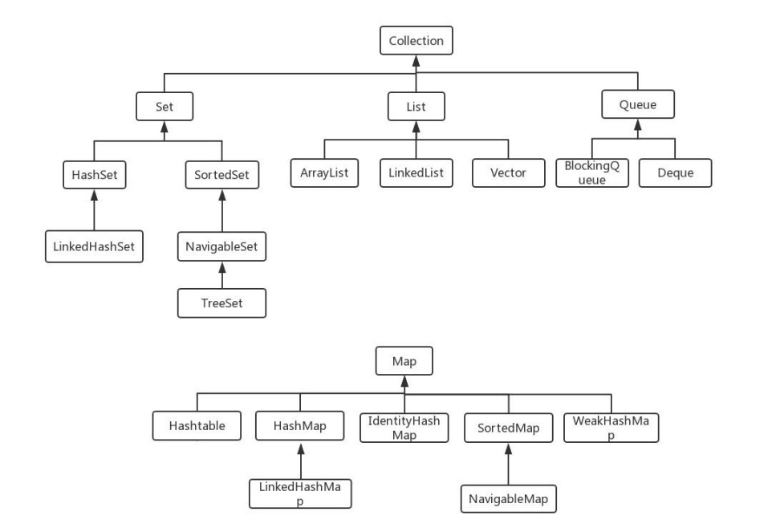

6. **Collection 和 Collections 有什么区别**

   - java.util.Collection 是一个集合接口(集合类的一个顶级接口)。它提供了对集合对象进行基本操作的通用接口方法。Colletion 接口在 Java 类库中有很多具体的实现。Collection 接口的意义是为各种具体的集合提供了最大化的统一操作方式，其直接继承接口有 List 与 Set 。
   - Collections 则是集合类的一个工具类/帮助类，其中提供了一系列静态方法，用于对集合元素进行排序、搜索以及线程安全等各种操作。 

7. **List、Set、Map 之间的区别是什么？**

   |    比较    |                          List                           |                           Set                            |                             Map                              |
   | :--------: | :-----------------------------------------------------: | :------------------------------------------------------: | :----------------------------------------------------------: |
   |  继承接口  |                       Collection                        |                        Collection                        |                                                              |
   | 常见实现类 | AbstractList(其常用子类有ArrayList、LinkedList、Vector) | AbstractSet(其常用子类有HashSet、LinkedHashSet、TreeSet) |                      HashMap、HashTable                      |
   |  常见方法  |   add()、remove()、clear()、get()、contains()、size()   |       add()、remove()、clear()、contains()、size()       | put()、get()、remove()、clear()、containsKey()、containsValue()、keySet()、values()、size() |
   |    元素    |                         可重复                          |                 不可重复(用 equals 判断)                 |                           不可重复                           |
   |    顺序    |                          有序                           |               无序(实际上由 HashCode 决定)               |                                                              |
   |  线程安全  |                     Vector线程安全                      |                                                          |                      HashTable线程安全                       |

8. **集合框架的底层数据架构**

   - List
     - ArrayList：Object数组
     - Vector：Object数组
     - LinkedList：双向循环链表
   - Set
     - HashSet（无序，唯一）基于HashMap实现的，底层采用HashMap来保存元素
     - LinkedHashSet：LinkedHashSet 继承 HashSet，内部通过 LinkedHashMap 来实现的。
     - TreeSet（有序，唯一）红黑树（自平衡的排序二叉树）
   - Map
     - HashMap：JDK 1.8之前 HashMap 由数组 + 链表组成的，数组是HashMap的主体，链表则是为了解决哈希冲突而存在的。JDK 1.8 以后在解决哈希冲突时有了较大的变化，当链表长度大于阈值（默认为8）时，将链表转换为红黑树，以减少搜索时间
     - LinkedHashMap：LinkedHashMap 继承自 HashMap，所以它的底层仍然是基于拉链式散列结构，即由数组和链表或红黑树组成。另外，LinkedHashMap 在上面结构的基础上，增加了一条双向链表，使得上面的结构可以保持键值对的插入顺序。同时通过对链表进行相应的操作，实现了访问顺序的相关逻辑。
     - HashTable：数组+链表组成的，数组是 HashMap 的主体，链表则是为了解决哈希冲突而存在的
     - TreeMap：红黑树（自平衡的排序二叉树）

9. **HashMap 和 HashTable 有什么区别？**

   - 线程安全：HashMap 是非线程安全的，HashTable 是线程安全的；HashTable 内部的方法基本都经过 synchronized 修饰。（如果需要保证线程安全，可以使用 ConcurrentHashMap）
   - HashMap 去掉了 HashTable 的 contains 方法，但是加上了 containsValue() 和 containsKey() 方法
   - HashTable 是同步的，而 HashMap 是非同步的，效率上比 HashTable 要高。HashTable 基本被淘汰，不要在代码中使用它
   - HashMap 允许空键值，而 HashTable 不允许。
   - 初始容量大小和每次扩容容量的大小不同：
     - 创建时如果不指定容量初始值，HashTable 默认的初始大小为11，之后每次补充，容量变为原来的 2n + 1。HashMap 默认的初始化大小为16。之后每次扩充，容量变为原来的2倍。
     - 创建时如果给定了初始容量值，那么 HashTable 会直接使用你给定的大小，而 HashMap 会将其扩充为 2 的幂次方大小。也就是说 HashMap 总是使用2的幂作为哈希表的大小。
   - 底层数据结构：JDK 1.8 以后的 HashMap 在解决哈希冲突时有了较大的变化，当链表长度大于阈值（默认为8）时，将链表转化为红黑树，以减少搜索时间。HashTable 没有这样的机制。 

10. **如何决定使用 HashMap 还是 TreeMap?**

    对于在 Map 中插入、删除和定位元素这类操作，HashMap 是最好的选择。然而，加入你需要对一个有序的 key 集合进行遍历，TreeMap 是更好的选择。基于你的 collection 的大小，也许向 HashMap 中添加元素会更快，将 map 换为 TreeMap 进行有序 key 的遍历。

11. **HashMap 和 ConcurrentHashMap 的区别**

    - ConcurrentHashMap 对整个桶数组进行了分割分段（Segment），然后在每一个分段上都用 lock 锁进行保护，相对于 HashTable 的 synchronized 锁的粒度更精细了一些，并发性能更好，而 HashMap 没有锁机制，不是线程安全的。（JDK 1.8 后ConcurrentHashMap 启用了一种全新的方式实现，利用CAS算法）
    - HashMap 的键值对允许有 null，但是ConcurrentHashMap 都不允许。

12. **ConcurrentHashMap 和 HashTable 的区别？**

    主要体现在实现线程安全方式上的不同

    - 底层数据结构：JDK 1.7 的 ConcurrentHashMap 底层采用 分段的数组 + 链表 实现，JDK 1.8 采用的数据结构跟 HashMap 一样，数组 + 链表/红黑树。HashTable 和 JDK 1.8 之前的 HashMap 的底层数据结构类似，都是采用 数组+链表 的形式，数组是 HashMap 的主体，链表则是主要为了解决哈希冲突而存在的
    - 实现线程安全的方式
      - 在 JDK 1.7 的时候，ConcurrentHashMap(分段锁) 对整个桶数组进行了分割分段（Segment）,每一把锁只锁容器其中一部分数据，多线程访问容器里不同数据段的数据，就不会存在锁竞争，提高并发访问率。（默认分配16个Segment，比HashTable 效率提高16倍）到了 JDK 1.8 的时候已经摒弃了 Segment 的概念，而是直接用 Node 数组+链表+红黑树的数据结构来实现，并发控制使用 synchronized 和 CAS 来操作。（JDK 1.6 以后对 synchronized 锁做了很多优化）整个看起来就像是优化过且线程安全的 HashMap，JDK 1.8 简化了 Segment 的属性，为了兼容旧版本。
      - HashTable(同一把锁)：使用 synchronized 来保证线程安全，效率非常低下。当一个线程访问同步方法时，其他线程也访问同步方法，可能会进入阻塞或轮询状态，如使用put添加元素，另一个线程不能使用 put 添加元素，也不能使用 get，竞争会越来越激烈效率越低

    两者的对比图：

    HashTable:

    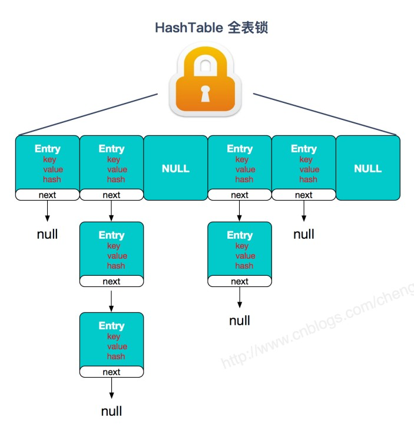

    JDK 1.7 的 ConcurrentHashMap:

    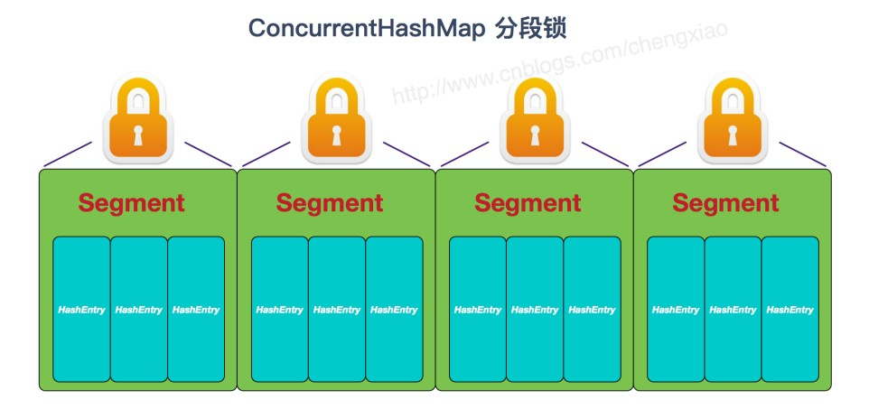

    JDK 1.8 的 ConcurrentHashMap（TreeBin：红黑二叉树节点 Node：链表节点）

    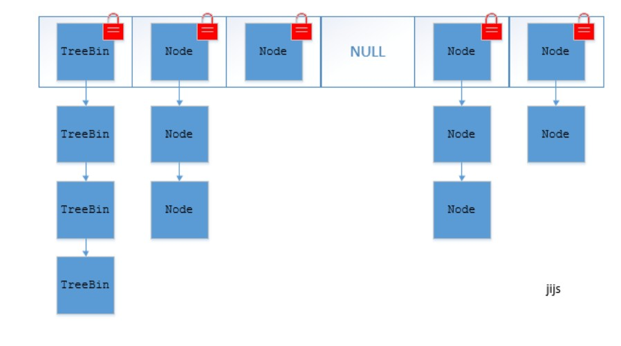

    ConcurrentHashMap 结合了 HashMap 和 HashTable 二者的优势。HashMap 没有考虑同步，HashTable 考虑了同步的问题。但 HashTable 在每次同步执行时都要锁住整个结构。ConcurrentHashMap 锁的方式是稍微细粒度的。

13. **ConcurrentHashMap 底层具体实现知道吗？实现原理是什么？**

    - JDK 1.7

      首先将数据分为一段一段存储，然后给每一段数据配一把锁，当一个线程占用锁访问其中一个段数据时，其他段的数据也能被其他线程访问。

      在JDK 1.7 中，ConcurrentHashMap 采用 Segment + HashEntry 的方式进行实现，结构如下：

      一个 ConcurrentHashMap 里包含一个 Segment 数组。Segment 的结构和 HashMap 类似，是一种数组和链表结构，一个 Segment 包含一个 HashEntry 数组，每个 HashEntry 是一个链表结构的元素，每个 Segment 守护着一个 HashEntry 数组里的元素，当对 HashEntry 数组的数据进行修改时，必须首先获得对应 Segment 的锁。

      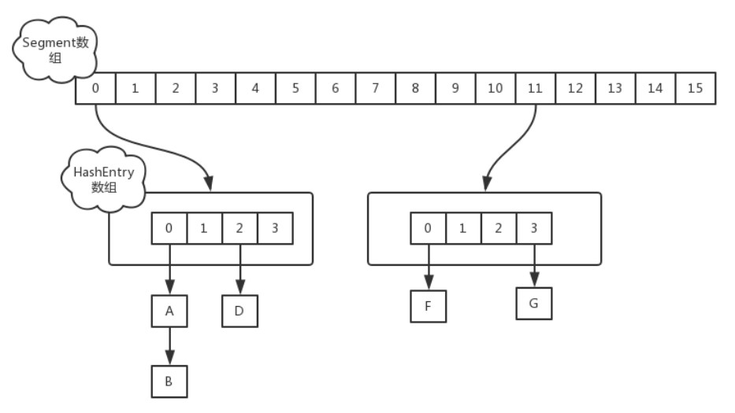

      - 该类包含两个静态内部类 HashEntry 和 Segment；前者用来封装映射表的键值对，后者用来充当锁的角色
      - Segment 是一种可重入的锁 ReentrantLock ，每一个 Segment 守护一个 HashEntry 数组里的元素，当对 HashEntry 数组的数据进行修改时，必须首先获得对应的 Segment 锁。

    - JDK 1.8

      在 JDK 1.8 中，放弃了 Segment 臃肿的设计，取而代之的是采用 Node + CAS + Synchronized 来保证并发安全进行实现，synchronized 只锁定当前链表或红黑二叉树的首节点，这样只要 hash 不冲突，就不会产生并发，效率提升

      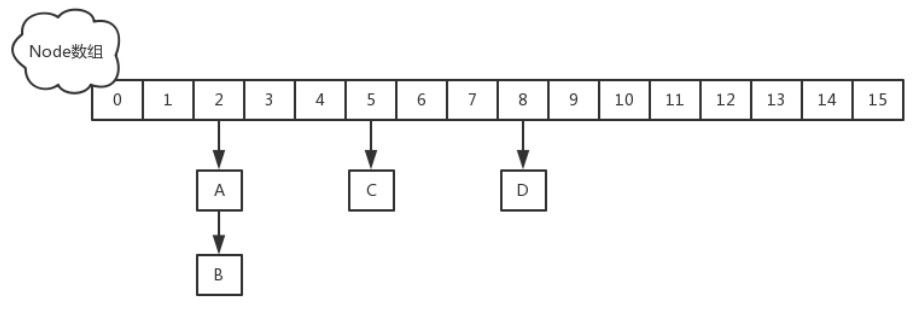

      插入元素过程：

      如果相应的位置的 Node 还没有初始化，则调用CAS插入相应的数据

      ```java
      else if ((f = tabAt(tab, i = (n - 1) & hash)) == null) {
          if (casTabAt(tab, i, null, new Node<K,V>(hash, key, value, null)))
          break; // no lock when adding to empty bin
      }
      ```

      如果相应位置的Node不为空，且该节点不处于移动状态，则对该节点加 synchronized 锁，如果该节点的 hash 不小于0，则遍历链表更新节点或插入新节点

      ```java
      if (fh >= 0) {
          binCount = 1;
          for (Node<K,V> e = f;; ++binCount) {
              K ek;
              if (e.hash == hash &&
                  ((ek = e.key) == key ||
                  (ek != null && key.equals(ek)))) {
                  oldVal = e.val;
                  if (!onlyIfAbsent)
                  e.val = value;
                  break;
          	}
              Node<K,V> pred = e;
              if ((e = e.next) == null) {
                  pred.next = new Node<K,V>(hash, key, value, null);
                  break;
              }
          }
      }
      ```

      - 如果该节点是 TreeBin 类型的节点，说明是红黑树结构，则通过 putTreeVal 方法往红黑树插入节点；如果 binCount 不为0，说明 put 操作对数据产生了影响，如果当前链表的个数到达8个，则通过 treeifyBin 方法转换为红黑树，如果 oldVal 不为空，说明是一次更新操作，没有对元素个数产生影响，则直接返回旧值
      - 如果插入的是一个新节点，则执行 addCount() 方法尝试更新元素个数 baseCount

14. **说一下 HashMap 的实现原理？**

    HashMap 概述：HashMap 是基于哈希表的 Map 接口的非同步实现。此实现提供所有可选的映射操作，并允许使用 null 值和 null 键。此类不保证映射的顺序，特别是它不保证该顺序恒久不变。	

    HashMap 的数据结构：在 java 编程语言中，最基本的结构就是两种，一个是数组，另外一个是模拟指针(引用)，所有的数据结构都可以用这两个基本结构来构造的，HashMap 也不例外。HashMap 实际上是一个“链表散列”的数据结构，即数组与链表的结合体。

    当我们往 HashMap 中 put 元素时，首先根据 key 的 hashCode 重新计算 hash 值，根据 hash 值得到这个元素在数组中的位置(下标)，如果该数组在该位置上已经存放了其他元素，那么在这个位置上的元素将以链表的形式存放，新加入的放在链头，最先加入的放在链尾，如果数组中该位置没有元素，就直接将该元素放到该数组的位置上。

    需要注意 JDK1.8 中对 HashMap 的实现做了优化，当链表中的节点元素超过8个之后，该链表会转换为红黑树来提高查询效率，从原来的O(n)到O(logn)。

15. **HashMap 在 JDK 1.7 和 JDK 1.8 中有哪些不同？HashMap的底层实现**

    在 JAVA 中，保存数据有两种比较简单的数据结构：数组和链表。数组的特点是：寻址容易，插入和删除困难；链表的特点是：寻址困难，但插入和删除容易；将数组和链表结合在一起，发挥两者各自的优势，使用拉链法可以解决哈希冲突。

    - JDK 1.8 之前

      拉链法：将链表与数组相结合。也就是说创建一个链表数组，数组中每一格就是一个链表。若遇到哈希冲突，将冲突的值加到链表中即可。

      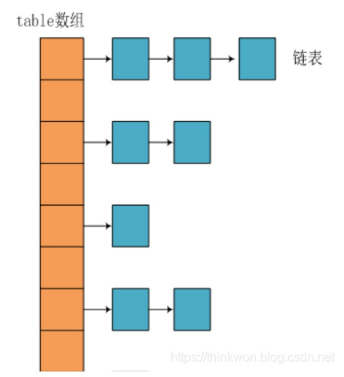

    - JDK 1.8 之后

      相比于之前的版本，jdk 1.8 在解决哈希冲突有了较大的变化，当链表长度大于阈值（默认为8）时，将链表转化为红黑树，以减少搜索时间。

      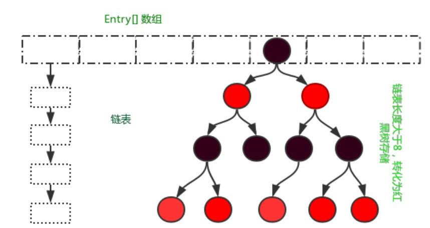

16. **HashMap JDK 1.7 与 JDK 1.8 比较**

    JDK 1.8 主要解决或优化了以下问题：

    - resize 扩容优化
    - 引入了红黑树，目的是避免单挑链表过长而影响查询效率
    - 解决了多线程死循环问题，但仍是非线程安全的，多线程时可能会造成数据丢失问题

    | 不同                       | JDK 1.7                                                      | JDK 1.8                                                      |
    | -------------------------- | ------------------------------------------------------------ | ------------------------------------------------------------ |
    | 存储结构                   | 数组 + 链表                                                  | 数组 + 链表 + 红黑树                                         |
    | 初始化方式                 | 单独函数：inflateTable()                                     | 直接集成到了扩容函数 resize() 中                             |
    | hash 值计算方式            | 扰动处理 = 9次扰动 = 4次位运算 + 5次异或运算                 | 扰动处理 = 2次扰动 = 1次位运算 + 1次异或运算                 |
    | 存放数据的规则             | 无冲突时，存放数组；冲突时，存放链表                         | 无冲突时，存放数组；冲突 & 链表长度 < 8：存放单链表；冲突 & 链表长度 > 8：树化并存放红黑树 |
    | 插入数据方式               | 头插法（先将原位置的数据移到后一位，再插入数据到该位置）     | 尾插法（直接插入到链表尾部/红黑树）                          |
    | 扩容后的存储位置的计算方式 | 全部按照原来方法进行计算（即hashcode ->> 扰动函数 ->> （h&length-1）） | 按照扩容后的规律计算（即扩容后的位置=原位置 or 原位置 + 旧容量） |

17. **HashMap 的 put 方法的具体流程？**

    当我们 put 的时候，首先计算 key 的 hash 值，这里调用了 hash 方法，hash 方法实际是让 key.hashCode() 与 key.hashCode() >>> 16 进行异或操作，高16bit补0，一个数和0异或不变，所以 hash 函数的大概作用就是：高16bit不变，低16bit和高16bit做了一个异或，目的是减少碰撞。按照函数注释，因为 bucket 数组大小是 2 的幂，计算下标 index = (table.length - 1) & hash ，如果不做 hash 处理，相当于散列生效的只有几个低 bit 位，为了减少散列的碰撞，设计者综合考虑了速度、作用、质量之后，使用高16 bit 和低16 bit 异或来简单处理减少碰撞，而且 JDK 8 中用了复杂度O(logn)的树结构来提升碰撞下的性能。

    putVal 方法执行流程图

    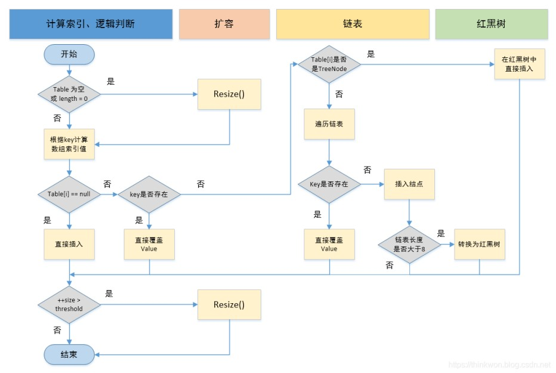

    ```java
    public V put(K key, V value) {
        return putVal(hash(key), key, value, false, true);
    }
    
    static final int hash(Object key) {
        int h;
        return (key == null) ? 0 : (h = key.hashCode()) ^ (h >>> 16);
    }
    
    // 实现Map.put和相关方法
    final V putVal(int hash, K key, V value, boolean onlyIfAbsent, boolean evict) {
        Node<K, V>[] tab;
        Node<K, V> p;
        int n, i;
        // 步骤1：tab为空则创建
        // table未初始化或长度为0，进行扩容
        if((tab = table) == null || (n = tab.length) == 0) {
            n = (tab = resize()).length;
        }
        // 步骤2：计算index，并对null做处理
    	// (n - 1) & hash 确定元素存放在哪个桶中，桶为空，新生成结点放入桶中(此时，这个结点是放在数组中)
        if ((p = tab[i = (n - 1) & hash]) == null) {
    		tab[i] = newNode(hash, key, value, null);
        } else {
            // 桶中已经存在元素
            Node<K,V> e; 
            K k;
            // 步骤3：节点key存在，直接覆盖value
            // 比较桶中第一个元素(数组中的结点)的hash值相等，key相等
            if (p.hash == hash && ((k = p.key) == key || (key != null && key.equals(k)))) {
                // 将第一个元素赋值给e，用e来记录
                e = p;
            } else if (p instanceof TreeNode) {
                // 步骤4：判断该链为红黑树
                // 如果当前元素类型是TreeNode，表示为红黑树，putTreeVal返回待存放的node，e可能为null
                // 放入树中
                e = ((TreeNode<K,V>)p).putTreeVal(this, tab, hash, key, value);
            } else {
                // 步骤5：该链为链表
                // 为链表结点
                for (int binCount = 0; ; ++binCount) {
                    // 到达链表的尾部
                    //判断该链表尾部指针是不是空的
                    if ((e = p.next) == null) {
                    // 在尾部插入新结点
                    p.next = newNode(hash, key, value, null);
                    //判断链表的长度是否达到转化红黑树的临界值，临界值为8
                    if (binCount >= TREEIFY_THRESHOLD - 1) // -1 for 1st
                    //链表结构转树形结构
                    treeifyBin(tab, hash);
                    // 跳出循环
                    break;
                    }
                    // 判断链表中结点的key值与插入的元素的key值是否相等
                    if (e.hash == hash && ((k = e.key) == key || (key != null && key.equals(k)))) {
                        // 相等，跳出循环
                        break;
                    }
                    // 用于遍历桶中的链表，与前面的e = p.next组合，可以遍历链表
                    p = e;
                }   
            }
            //判断当前的key已经存在的情况下，再来一个相同的hash值、key值时，返回新来的value这个值
            if (e != null) {
                // 记录e的value
                V oldValue = e.value;
                // onlyIfAbsent为false或者旧值为null
                if (!onlyIfAbsent || oldValue == null)
                //用新值替换旧值
                e.value = value;
                // 访问后回调
                afterNodeAccess(e);
                // 返回旧值
                return oldValue;
            }
        }
        // 结构性修改
        ++modCount;
        // 步骤6：超过最大容量就扩容
        // 实际大小大于阈值则扩容
        if (++size > threshold)
        resize();
        // 插入后回调
        afterNodeInsertion(evict);
        return null;
    }
    ```

    1. 判断键值对数组table[i]是否为空或为null，否则执行resize()进行扩容
    2. 根据键值 key 计算 hash 值得到插入的数据索引i，如果table[i] == null，直接新建节点添加，转向步骤6，如果 table[i]不为空，转向步骤3
    3. 判断table[i] 的首个元素是否和key一样，如果相同则直接覆盖 value，否则转向步骤4，这里的相同指的是 hashCode 以及 equals
    4. 判断table[i] 是否为 TreeNode，即 table[i] 是否是红黑树，如果是红黑树，则直接在树中插入键值对，否则转向步骤5
    5. 遍历table[i]，判断链表长度是否大于8，大于8的话把链表转换为红黑树，在红黑树中执行插入操作，否则进行链表的插入操作；遍历过程中若发现key已经存在直接覆盖value即可
    6. 插入成功后，判断实际存在的键值对数量size是否超过了最大容量threshold，如果超过，进行扩容。

18. **HashMap 的扩容操作是怎么实现的？**

    1. 在 JDK 1.8 中，resize 方法是在 hashMap 中的键值对大于阈值时或者初始化时，就调用 resize 方法进行扩容；
    2. 每次扩展的时候，都是扩展2倍
    3. 扩展后的 Node 对象的位置要么在原位置，要么移动到原偏移量两倍的位置。

    在 putVal() 中，我们看到在这个函数里面使用了2次 resize 方法，resize方法表示的在进行第一次初始化时会对其进行扩容，或者当该数组的实际大小大于其临界值（第一次为12），这个时候在扩容的同时也会伴随桶上面的元素进行重新分发，这也是 JDK 1.8 版本的一个优化的地方。在 1.7 中，扩容以后需要重新计算其 Hash 值，根据 Hash 值对其进行分发。但在 1.8 版本中，则是根据在同一个桶的位置中进行判断（e.hash & oldCap）是否为0，重新进行 hash 分配后，该元素的位置要么停留在原始位置，要么移动到原始位置 + 增加的数组大小这个位置上

19. **HashMap 是怎么解决哈希冲突的**

    - 哈希：Hash，一般翻译为“散列”，也有直接音译“哈希”的，就是把任意长度的输入通过散列算法，变换成固定长度的输出，该输出就是散列值（哈希值）；这种转换是一种压缩映射，散列值的空间通常远小于输入的空间，不同的输入可能会散列成相同的输出，所以不可能从散列值来唯一的确定输入值。简单的说就是一种将任意长度的消息压缩到某一固定长度的消息摘要的函数。

      所有散列函数都有如下一个基本特性：根据同一散列函数计算出的散列值如果不同，那么输入值肯定也不同。但是，根据同一散列函数计算出的散列值如果相同，输入值不一定相同。

    - 哈希冲突：当两个不同的输入值，根据同一散列函数计算出相同的散列值的现象，我们就把它叫做哈希碰撞

    - HashMap的数据结构：在 Java 中，保存数据有两种比较简单的数据结构：数组和链表。数组的特点是：寻址容易，插入和删除困难；链表的特点是：寻址困难，插入和删除容易；所以将数组和链表结合在一起，发挥两者各自的优势，使用一种叫做链地址法的方式可以解决哈希冲突：

      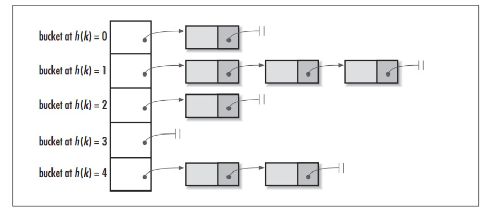

      这样就可以将拥有相同哈希值的对象组织成一个链表放在 hash 值所对应的 bucket 下，但相比于 hashCode 返回的 int 类型，我们 HashMap 初始的容量大小 DEFAULT_INITIAL_CAPACITY = 1 << 4 (即2的4次方16) 要远小于 int 类型的范围，所以只是使用 hashCode 取余来获取对应的 bucket 这将会大大增加哈希碰撞的概率，并且最坏的情况下还会将 HashMap 变成一个单链表，所以还需要对 hashCode 做一定的优化

    - hash() 函数：上面的问题，主要是因为如果使用 hashCode 取余，相当于参与运算的只有 hashCode 的低位，高位是没有起到任何作用的，所以思路就是让 hashCode 取值出的高位也参与运算，进一步降低 hash 碰撞的概率，使数据分布更平均，我们把这样的操作称为扰动，JDK 1.8 中的 hash() 函数如下

      ```java
      static final int hash(Object key) {
          int h;
          return (key == null) ? 0 : (h = key.hashCode()) ^ (h >>> 16);// 与自己右移16位进行异或运算（高低位异或）
      }
      ```

      相比于 JDK 1.7中，更为简洁。JDK 1.7 中4次位运算，5次异或运算，一共9次扰动，在1.8中，只进行1次位运算和1次异或运算，2次扰动

    - JDK 1.8 新增红黑树

      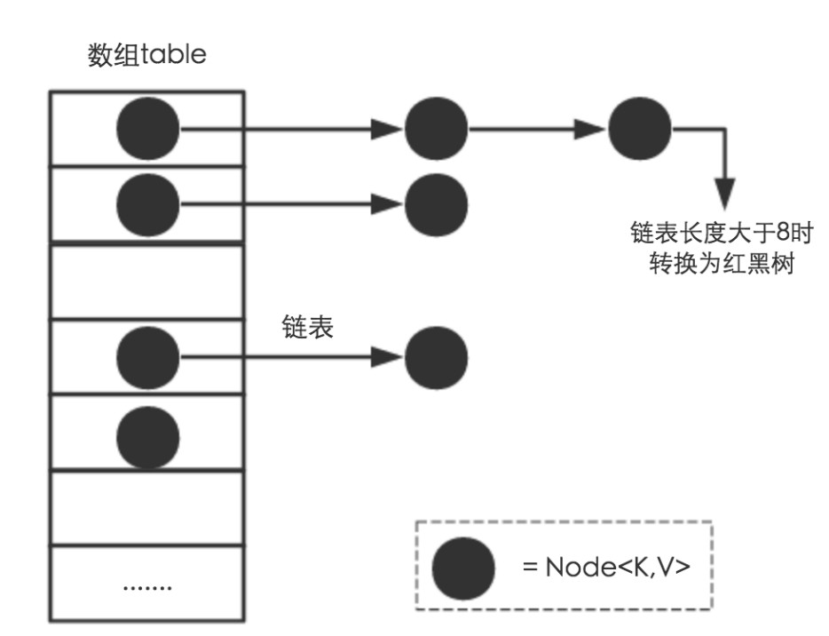

      通过上面的链地址法（使用散列表）和扰动函数成功让我们的数据分布更平均，哈希碰撞减少，但当我们 HashMap 中存在大量数据时，加入我们某个 bucket 下对应的链表有 n 个元素，那么遍历时间复杂度就为 O(n)，为了针对这个问题，JDK 1.8 在 HashMap 中新增了红黑树的数据结构，进一步使遍历的复杂度降为 O(logn);

    - 总结一下HashMap是使用哪些方法来有效解决哈希冲突的
      - 使用链地址法（使用散列表）来链接拥有相同 hash 值的数据
      - 使用2次扰动函数来降低哈希冲突的概率，使数据分布更平均
      - 引入红黑树进一步降低遍历的时间复杂度，使遍历更快

20. **能否使用任何类作为 Map 的 key**

    可以，但要考虑以下几点：

    - 如果类重写了 equals() 方法，也应该重写 hashCode() 方法
    - 类的所有实例需要遵循 equals() 和 hashCode() 相关的规则
    - 如果一个类没有使用 equals()，不应该在 hashCode() 中使用它
    - 用户自定义的 Key 类最佳实践是使之为不可变的，这样 hashCode() 值可以缓存起来，拥有更好的性能。不可变的类也可以确保 hashCode() 和 equals() 在未来不会改变，这样就会解决与可变相关的问题了。

21. **为什么 HashMap 中 String、Integer 这样的包装类适合作为 Key**

    String、Integer 等包装类的特性能够保证 Hash 值的不可更改性和计算准确性，能够有效的减少 Hash 碰撞的几率

    - 都是 final 类型，即不可变，保证 key 的不可更改性，不会存在获取 hash 值不同的情况
    - 内部已重写了 equals()、hashCode() 等方法，遵守了 HashMap 内部的规范，不容易出现 Hash 值计算错误的情况

22. **如果使用 Object 作为 HashMap 的 Key，应该怎么办**

    重写 hashCode() 和 equals() 方法

    - 重写 hashCode() 是因为需要计算存储数据的存储位置，需要注意不要试图从散列码计算中排除掉一个对象的关键部分来提高性能，这样虽然能更快但可能会导致更多的 Hash 碰撞
    - 重写 equals() 方法，需要遵守自反性、对称性、传递性、一致性以及对于任何非 null 的引用值x，x.equals(null) 必须返回 false 的这几个特性，目的是为了保证 key 在哈希表中的唯一性； 

23. **HashMap 为什么不直接使用 hashCode() 处理后的哈希值直接作为 table 的下标？**

    hashCode 返回的是 int 整数类型，其范围是 -(2^31)~(2^31 - 1)，约有 40 亿个映射空间，而 HashMap 的容量范围是在16（初始化默认值）~2 ^ 30，HashMap 通常情况下是取不到最大值的，并且设备上也难以提供这么多的存储空间，从而导致通过 hashCode() 计算出的哈希值可能不在数组大小范围内，进而无法匹配存储位置；

    如何解决：

    - HashMap 自己实现了自己的 hash() 方法，通过两次扰动使它自己的 hash 值高低位自行进行异或运算，降低哈希碰撞概率也使数据分布更平均；
    - 在保证数组长度为2的幂次方的时候，使用 hash() 运算之后的值与运算（&）（数组长度 - 1）来获取数组下标的方式进行存储，这样一来是比取余操作更加有效率，二来也是因为只有当数组长度为2的幂次方时，h&(length - 1) 才等价于 h%length，三来解决了“哈希值与数组大小范围不匹配”的问题

24. **HashMap 的长度为什么是2的幂次方**

    为了能让 HashMap 存储高效，尽量减少碰撞，也就是要尽量把数据分配均匀，每个链表/红黑树长度大致相同。这个实现就是把数据存到哪个链表/红黑树的算法

    - 算法如何设计

      首先可能会想到用取余的操作来实现，但是，取余操作如何除数是2的幂次方则等价于与其除数减一的与(&)操作（hash%length == hash&(length-1)）。并且采用二进制 & 操作，相对于 % 操作能够提高运算效率，这就解释了 HashMap 的长度为什么是2的幂次方

    - 为什么是两次扰动

      加大哈希值低位的随机性，使分布更均匀，从而提高对应数组存储下标位置的随机性&均匀性，最终减少Hash冲突，达到了高位低位同时参与运算的目的

25. **说一下 HashSet 的实现原理？**

    - HashSet 的底层由 HashMap 实现。
    - HashSet 的值存放在 HashMap 的 key 上。
    - HashMap 的 Value 统一为 PRESENT。

    因此 HashSet 的实现比较简单，相关的操作，基本上都是调用底层 HashMap 的相关方法来完成，HashSet 不允许重复的值。

26. **HashSet 如何检查重复？HashSet如何保证数据不重复？**

    向 HashSet 中 add() 元素时，判断元素是否存在的依据，不仅要比较 hash 值，同时还要结合 equals 方法比较。

    Hashset 中的 add() 方法会使用 HashMap 的 put() 方法

    HashMap 的 key 是唯一的，在 HashMap 中如果 K/V 相同时，会用新的 V 覆盖旧的 V，然后返回旧的 V。所以不会重复（HashMap 比较 Key 是否相等先比较hashcode 再比较 equals）

    ```java
    private static final Object PRESENT = new Object();
    private transient HashMap<E,Object> map;
    
    public HashSet() {
    	map = new HashMap<>();
    }
    
    public boolean add(E e) {
        // 调用HashMap的put方法,PRESENT是一个至始至终都相同的虚值
        return map.put(e, PRESENT)==null;
    }
    ```

27. **HashSet 与 HashMap 的区别**

    | HashMap                                                 | HashSet                                                      |
    | ------------------------------------------------------- | ------------------------------------------------------------ |
    | 实现了Map接口                                           | 实现Set接口                                                  |
    | 存储键值对                                              | 只存储对象                                                   |
    | 调用 put() 向 map 中添加元素                            | 调用 add() 方法向 Set 中添加元素                             |
    | HashMap 使用键（key）计算 Hashcode                      | HashSet 使用成员对象来计算 hashcode值，对于两个对象来说，hashcode可能相同，所以再用equals() 方法来判断对象的相等性，如果两个对象不同，则返回false |
    | HashMap 相对于 HashSet 快，因为它是使用唯一的键获取对象 | HashSet 较 HashMap 来说比较慢                                |

28. **ArrayList 和 LinkedList 的区别是什么？**

    最明显的区别是 ArrayList 底层的数据结构是数组，支持随机访问，而LinkedList 的底层数据结构是双向循环链表，不支持随机访问。使用下标访问一个元素，ArrayList 的时间复杂度是O(1)，而LinkedList 是 O(n)。

29. **ArrayList的优缺点**

    优点：

    - 底层以数组实现，是一种随机访问模式。实现了 RandomAccess 接口，因此查询非常快
    - 在顺序添加一个元素的时候非常方便

    缺点：

    - 删除元素的时候，需要做一次元素的复制操作。如果要复制的元素很多，那么就比较耗费性能
    - 插入元素的时候，也需要做一次元素复制操作，缺点同上。

    ArrayList 比较适合顺序添加、随机访问的场景

30. **如何实现数组和 List 之间的转换**

    - List 转换成数组：调用 ArrayList 的 toArray() 方法。
    - 数组转换成 List：调用 Arrays 的 asList 方法。

    ```java
    // list to array
    List<String> list = new ArrayList<String>();
    list.add("123");
    list.add("456");
    list.toArray();
    
    // array to list
    String[] array = new String[]{"123","456"};
    Arrays.asList(array);
    ```

31. **ArrayList 和 LinkedList 的区别是什么**

    - 数据结构的实现：ArrayList 是动态数组的数据结构实现，而 LinkedList 是双向链表的数据结构实现。
    - 随机访问效率：ArrayList 比 LinkedList 在随机访问的时候效率要高，因为 LinkedList 是线性的数据存储方式，所以需要移动指针从前往后依次查找。
    - 增加和删除效率：在非首尾的增加和删除操作，LinkedList 要比 ArrayList 效率要高。因为 ArrayList 增删操作要影响数组内的其他数据的下标。
    - 内存空间引用：LinkedList 比 ArrayList 更占内存，因为 LinkedList 的节点除了存储数据，还存储了两个引用，一个指向前一个元素，一个指向后一个元素。
    - 线程安全：ArrayList 和 LinkedList 都是不同步的，都不能保证线程安全 

    在需要频繁读取集合中的元素时，推荐使用 ArrayList，而在插入和删除操作较多时，更推荐使用 LinkedList

    双向链表也叫双链表，是链表的一种，它的每个数据节点都有两个指针，分别指向直接后继和直接前驱。所以，从双向链表中的任意一个节点开始，都可以很方便地访问它的前驱结点和后继节点。

32. **ArrayList 和 Vector 的区别是什么？**

    - Vector 是同步的，而 ArrayList 不是。然而，如果你寻求在迭代的时候对列表进行改变，应该使用 CopyOnWriteArrayList。
    - ArrayList 比 Vector 快，它因为有同步，不会过载。
    - ArrayList 更加通用，因为我们可以使用Collections工具类轻易地获取同步列表和只读列表。
    - ArrayList 和 Vector 都会根据实际的需要动态的调整容量，只不过在 Vector 扩容每次会增加 1 倍，而 ArrayList 只会增加 50%

33. **插入数据时，ArrayList、LinkedList、Vector谁速度较快？阐述ArrayList、Vector、LinkedList 的存储性能和特性？**

    ArrayList、LinkedList、Vector 底层的实现都是使用数组方式存储数据。数组元素数大于实际存储的数据以便增加和插入元素，它们都允许直接按序号索引元素。但是插入元素要涉及数组元素移动等内存操作，所以索引数据块而插入数据慢。

    Vector 中的方法由于加了 synchronized 修饰，因此 Vector 是线程安全容器，但性能上较 ArrayList 差。

    LinkedList 使用双向链表实现存储，按序号索引数据需要进行前向或后向遍历，但插入数据时只需要记录当前项的前后项即可，所以 LinkedList 插入速度较快。

34. **多线程下如何使用 ArrayList**

    ArrayList 不是线程安全的，如果遇到多线程场景，可以通过 Collections 的 synchronizedList 方法将其转换成线程安全的容器后再使用。

    ```java
    List<String> synchronizedList = Collections.synchronizedList(list);
    synchronizedList.add("aaa");
    synchronizedList.add("bbb");
    
    for (int i = 0; i < synchronizedList.size(); i++) {
    	System.out.println(synchronizedList.get(i));
    }
    ```

35. **为什么ArrayList 的 elementData 加上 transient 修饰？**

    ArrayList 中的数组定义如下：

    ```java
    private transient Object[] elementData;
    ```

    再看下 ArrayList 的定义：

    ```java
    public class ArrayList<E> extends AbstractList<E>
    	implements List<E>, RandomAccess, Cloneable, java.io.Serializable
    ```

    ArrayList 实现了 Seriallizable 接口，意味着 ArrayList 支持序列化。transient 的作用是说不希望 elementData 数组被序列化，重写了 writeObject 的实现

    ```java
    private void writeObject(java.io.ObjectOutputStream s) throws
    java.io.IOException{
        *// Write out element count, and any hidden stuff*
        int expectedModCount = modCount;
        s.defaultWriteObject();
        *// Write out array length*
        s.writeInt(elementData.length);
        *// Write out all elements in the proper order.*
        for (int i=0; i<size; i++)
        s.writeObject(elementData[i]);
        if (modCount != expectedModCount) {
        throw new ConcurrentModificationException();
    }
    ```

    每次序列化时，先调用 defaultWriteObject() 方法序列化 ArrayList 中非 transient 元素，然后遍历 elementData，只序列化已存入的元素，这样既加快了序列化的速度，又减小了序列化之后的文件大小。

36. **List 和 Set 的区别**

    List，Set 都是继承自 Collection 接口

    - List 特点：一个有序（元素存入集合的顺序与取出的顺序一致）容器，元素可以重复，可以插入多个 null 元素，元素都有索引。支持for循环，也就是通过下标来遍历，也可以用迭代器。可以动态增长，查找元素效率高，插入删除元素效率低，因为会引起其他元素位置改变。
    - Set 特点：一个无序（存入和取出顺序有可能不一致）容器，不可以存储重复元素，只允许存入一个 null 元素，必须保证元素唯一性。只能用迭代器。检索效率低下，删除和插入效率高，插入和删除不会引起元素位置改变。

37. **Array 和 ArrayList 有何区别？**

    - Array 可以容纳基本类型和对象，而 ArrayList 只能容纳对象。
    - Array 是指定大小的，而 ArrayList 大小是自动扩展的。
    - Array 没有提供 ArrayList 那么多功能，比如 addAll、removeAll 和 iterator 等。

    对于基本类型数据，集合使用自动装箱来减少工作量。但是，当处理固定大小的基本数据类型时，这种方式相对较慢

38. **BlockingQueue 是什么**

    Java.util.concurrent.BlockingQueue是一个队列，在进行检索或移除一个元素的时候，它会等待队列变为非空；当在添加一个元素时，它会等待队列中的可用空间。BlockingQueue接口是 Java 集合框架的一部分，主要用于实现生产者-消费者模式。不需要担心等待生产者有可用的空间，或消费者有可用的对象，这些都在 BlockingQueue的实现类中被处理了。Java 提供的实现有 ArrayBlockingQueue、LinkedBlockingQueue、PriorityBlockingQueue、SynchronousQueue。

39. **在 Queue 中 poll() 和 remove() 有什么区别？**

    poll() 和 remove() 都是从队列中取出一个元素，但是 poll() 在获取元素失败的时候会返回空，但是 remove() 失败的时候会抛出异常。

    ```java
    Queue<String> queue = new LinkedList<String>();
    queue. offer("string"); // add
    System. out. println(queue. poll());
    System. out. println(queue. remove());
    System. out. println(queue. size());
    ```

40. **哪些集合是线程安全的？**

    - vector：就比 arrayList 多了个同步化机制(线程安全)，因为效率较低，现在已经不太建议使用。在 web 应用中，特别是前台页面，往往效率（页面响应速度）是优先考虑的。
    - stack：堆栈类，先进后出。
    - hashTable：就比 hashmap 多了个线程安全。
    - enumeration：枚举，相当于迭代器。

41. **Java 集合的快速失败机制“fail-fast”**

    是 Java 集合的一种错误检测机制，当多个线程对集合进行结构上的改变的操作时，有可能会产生 fail-fast 机制

    例如：线程1通过 Iterator 在遍历集合A的元素，在某个时候线程2修改了集合A的结构（是结构上面的修改，而不是简单的修改集合元素的内容），这个时候程序就会抛出 ConcurrentModificationException 异常，从而产生 fail-fast 机制。

    原因：迭代器在遍历时直接访问集合中的内容，并且在遍历过程中使用一个 modCount 变量。变量在被遍历期间如果内容发生变化，就会改变 modCount 的值。每当迭代器使用 hashNext()/next()遍历下一个元素之前，都会检测 modCount 变量是否为 expectedmodCount 值，是的话就返回遍历；否则抛出异常，终止遍历。

    解决方法：

    - 在遍历过程中，所有涉及到改变modCount值的地方全部加上synchronized
    - 使用CopyOnWriteArrayList来替换ArrayList

42. **怎么确保一个集合不能被修改**

    使用Collections.unmodifiableCollection(Collection c) 方法来创建一个只读集合，这样改变集合的任何操作都会抛出 Java.lang.UnSupportedOperationException 异常。

    ```java
    List<String> list = new ArrayList<>();
    list. add("x");
    Collection<String> clist = Collections. unmodifiableCollection(list);
    clist. add("y"); // 运行时此行报错
    System. out. println(list. size());
    ```

43. **迭代器 iterator 是什么？**

    迭代器是一种设计模式，它是一个对象，它可以遍历并选择序列中的对象，而开发人员不需要了解该序列的底层结构。迭代器通常被称为“轻量级”对象，因为创建它的代价小。

44. **Iterator 怎么使用？有什么特点？**

    Java 中的 Iterator 功能比较简单，并且只能单向移动：

    1. 使用方法 iterator() 要求容器返回一个 Iterator。第一次调用 Iterator 的 next() 方法时，它返回序列的第一个元素。注意：iterator() 方法时 java.lang.Iterable 接口，被 Collection 继承。
    2. 使用 next() 获得序列中的下一个元素。
    3. 使用 hasNext() 检查序列中是否还有元素。
    4. 使用 remove() 将迭代器新返回的元素删除。

    Iterator 是 Java 迭代器最简单的实现，为 List 设计的 ListIterator 具有更多的功能，它可以从两个方向遍历 List，也可以从 List 中插入和删除元素。

    常见错误：

    ```java
    for(Integer i : list){
    	list.remove(i)
    }
    ```

    运行以上代码会报 ConcurrentModificationException 异常。当使用for(Integer i : list) 语句时，会自动生成一个 iterator 来遍历该 list，但同时该 list 正在被 Iterator.remove() 修改。Java 一般不允许一个线程在遍历 Collection 时，另一个线程修改它。

45. **Iterator 和 ListIterator 有什么区别？**

    - Iterator 可用来遍历 Set 和 List 集合，但是 ListIterator 只能用来遍历 List。
    - Iterator 对集合只能是前向遍历，ListIterator 既可以前向也可以后向。
    - ListIterator 实现了 Iterator 接口，并包含其他的功能，比如：增加元素，替换元素，获取前一个和后一个元素的索引，等等。

46. **遍历一个List有哪些不同的方式？每种方法的实现原理是什么？Java 中 List 遍历的最佳实践是什么**

    遍历方式有以下几种：

    - for 循环遍历，基于计数器。在集合外部维护一个计数器，然后依次读取每一个位置的元素，当读取到最后一个元素后停止。
    - 迭代器遍历，Iterator。Iterator 是面向对象的一个设计模式，目的是屏蔽不同数据集合的特点，统一遍历集合的接口。Java 在 Collections 中支持了 Iterator 模式。
    - foreach 循环遍历。foreach 内部也是使用了 Iterator 的方式实现，使用时不需要显示声明 Iterator 或计数器。
      - 优点：代码简洁，不易出错
      - 缺点：只能做简单的遍历，不能在遍历过程中操作数据集合，例如删除，替换。

    最佳实践：Java Collections 框架提供了一个 RandomAccess 接口，用来标记 List 实现是否支持Random Access

    - 如果一个数据集合实现了该接口，按位置读取元素的平均时间复杂度为 O(1)，如 ArrayList
    - 如果没有实现该接口，表示不支持 Random Access，如LinkedList

    推荐做法：支持Random Access 的列表可用 for 循环遍历，否则建议用 Iterator 或 foreach 遍历

47. **comparable 和 comparator 的区别**

    - comparable 接口实际上是出自 java.lang 包，它有一个 compareTo(Object obj) 方法用来排序
    - comparator 接口实际上是出自 java.util 包，它有一个 compare(Object obj1, Object obj2) 方法用来排序

    一般我们需要对一个集合使用自定义排序时，我们就要重写 compareTo 方法或 compare 方法，当我们需要对某一个集合实现两种排序方式，比如一个 song 对象中的歌名和歌手名分别采用一种排序方法的话，我们可以重写 compareTo 方法和使用自制的 Comparator 方法或者以两个 Comparator 来实现歌名排序和歌星名排序，第二种代表我们只能使用两个参数版的 Collections.sort()

48. **TreeMap 和 TreeSet 在排序时如何比较元素？Collections 工具类中的 sort() 方法如何比较元素**

    TreeSet 要求存放的对象所属的类必须实现 Comparable 接口，该接口提供了比较元素的 compareTo() 方法，当插入元素时会回调该方法比较元素的大小。TreeMap 要求存放的键值对映射的键必须实现 Comparable 接口从而根据键对元素进行排序

    Collections 工具类的 sort 方法有两种重载的形式

    - 第一种要求传入的待排序容器中存放的对象比较实现 Comparable 接口以实现元素的比较
    - 第二种不强制性的要求容器中的元素可比较，但是要求传入第二个参数，参数时 Comparable 接口的子类型（需要重写 compare 方法实现元素的比较），相当于一个临时定义的排序规则，其实就是通过接口注入比较元素大小的算法，也是对回调模式的应用（Java 中对函数式编程的支持）

    


