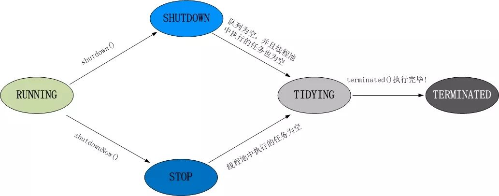
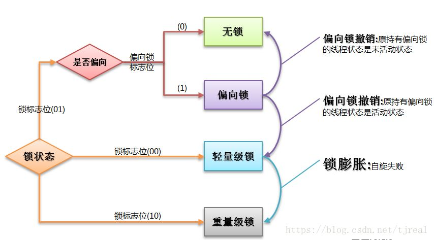
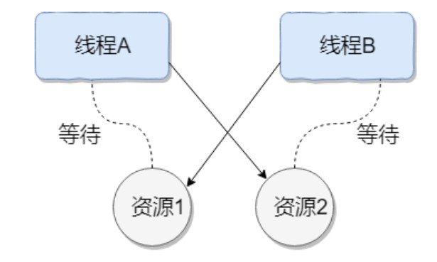

# 并发编程

1. **为什么要使用并发编程**

   - 充分利用多核CPU的计算能力：通过并发编程的形式可以将多核CPU的计算能力发挥到极致，性能得到提升
   - 方便进行业务拆分，提升系统并发能力和性能：在特殊的业务场景下，先天的就适合于并发编程。多线程并发编程正是开发高并发系统的基础，利用好多线程的机制可以大大提高系统整体的并发能力以及性能。面对复杂业务模型，并行程序会比串行程序更适应业务需求，而并发编程更能吻合这种业务拆分。

2. **并发编程的缺点**

   并发编程的目的就是为了能提高程序的执行效率，提高程序运行速度，但是并发编程并不总是能提高程序运行速度的，而且并发编程可能会遇到许多问题：内存泄漏、上下文切换、线程安全、死锁等问题

3. **并发编程的三要素是什么？在 java 程序中怎么保证多线程的运行安全**

   三要素：

   - 原子性：指是一个或多个操作要么全部执行成功要么全部执行失败
   - 可见性：一个线程对共享变量的修改，另一个线程能够立刻看到（synchronized, volatile）
   - 有序性：程序执行的顺序按照代码的先后顺序执行（处理器可能会对指令进行重排序）

   出现线程安全的原因：

   - 线程切换带来的原子性问题
   - 缓存导致的可见性问题
   - 编译优化带来的有序性问题

   解决办法：

   - JDK Atomic 开头的原子类、synchronized、LOCK，可以解决原子性问题
   - synchronized、volatile、LOCK，可以解决可见性问题
   - Happens-Before 规则可以解决有序性问题

4. **并行和并发有什么区别？**

   - 并行是指单位时间内，多个处理器或多核处理器同时处理多个任务；而并发是指多个任务在同一个CPU核上，按细分的时间片轮流（交替）执行，从逻辑上看那些任务是同时执行。
   - 并行是在不同实体上的多个事件，并发是在同一实体上的多个事件。
   - 串行：有n个任务，由一个线程按顺序执行。由于任务、方法都在一个线程执行所以不存在线程不安全情况，也就不存在临界区的问题

   并发 == 两个队列和一个咖啡机

   并行 == 两个队列和两台咖啡机

   串行 == 一个队列和一台咖啡机

   所以并发编程的目标是充分的利用处理器的每一个核，以达到最高的处理性能。

5. **什么是多线程，多线程的优劣**

   - 多线程：多线程是指程序中包含多个执行流，即在一个程序中可以同时运行多个不同的线程来执行不同的任务。

   - 多线程的好处：可以提高 CPU 的利用率。在多线程程序中，一个线程必须等待的时候，CPU 可以运行其它的线程而不是等待，这样就大大提高了程序的效率。也就是说允许单个程序创建多个并行执行的线程来完成各自的任务。
   - 多线程的劣势
     - 线程也是程序，所以线程需要占用内存，线程越多占用内存也越多
     - 多线程需要协调和管理，所以需要 CPU 时间跟踪线程
     - 线程之间对共享资源的访问会相互影响，必须解决竞用共享资源的问题

6. **线程与进程的区别？**

   - 进程：一个在内存中运行的应用程序。每个进程都有自己独立的一块内存空间，一个进程可以有多个线程，比如在 Windows 系统中，一个运行的 xx.exe 就是一个进程。
   - 线程：进程中的一个执行任务（控制单元），负责当前进程中程序的执行。一个进程至少有一个线程，一个进程可以运行多个线程，多个线程可共享数据

   线程具有许多传统进程所具有的特征，故又称为轻型进程（Light-Weight Process）或进程元；而把传统的进程称为重型进程（Heavy-Weight Process），它相当于只有一个线程任务。在引入了线程的操作系统中，通常一个进程都有若干个线程，至少包含一个线程。

   - 根本区别：进程是操作系统资源分配的基本单位，而线程是处理器任务调度和执行的基本单位
   - 资源开销：每个进程都有独立的代码和数据空间（程序上下文），程序之间的切换会有较大的开销；线程可以看做轻量级的进程，同一类线程共享代码和数据空间，每个线程都有自己独立的运行栈和程序计数器（PC），线程之间切换的开销小
   - 包含关系：如果一个进程内有多个线程，则执行过程不是一条线的，而是多条线（线程）共同完成的；线程是进程的一部分，所以线程也被称为轻权进程或轻量级进程
   - 内存分配：同一进程的线程共享本进程的地址空间和资源，而进程之间的地址空间和资源是相互独立的
   - 影响关系：一个进程崩溃后，在保护模式下不会对其他进程产生影响，但是一个线程崩溃整个进程都死掉。所以多进程比多线程健壮。
   - 执行过程：每个独立的进程有程序运行的入口、顺序执行序列和程序出口。但是线程不能独立执行，必须依存在应用程序中，由应用程序提供多个线程执行控制，两者均可并发执行

   简而言之，进程是程序运行和资源分配的基本单位，一个程序至少有一个进程，一个进程至少有一个线程。进程在执行过程中拥有独立的内存单元，而多个线程共享内存资源，减少切换次数，从而效率更高。线程是进程的一个实体，是 CPU 调度和分派的基本单位，是比程序更小的能独立运行的基本单位。同一进程中的多个线程之间可以并发执行。

7. **什么是上下文的切换**

   多线程编程中一般线程的个数都大于 CPU 核心的个数，而一个 CPU 核心在任意时刻只能被一个线程使用，为了让这些线程都能得到有效执行；CPU 采取的策略是为每个线程分配时间片并轮转的形式。当一个线程的时间片用完的时候就会重新处于就绪状态让给其他线程使用，这个过程就属于一次上下文切换。

   概括来说就是：当前任务在执行完 CPU 时间片切换到另一个任务之前会先保存自己的状态，以便下次再次切换回这个任务时，可以再加载这个任务的状态。任务从保存到再加载的过程就是一次上下文切换。

   上下文切换通常是计算密集型的。也就是说，它需要相当可观的处理器时间，在每秒几十上百次的切换中，每次切换都需要纳秒量级的时间。所以，上下文切换系统对系统来说意味着消耗大量的 CPU 时间，事实上，可能是操作系统中时间消耗最大的操作。

   linux 相比其他操作系统（包括其他类 Unix 系统）有很多的优点，其中有一项就是，其上下文切换和模式切换的时间消耗非常少。

8. **守护线程是什么？和用户线程有什么区别**

   - 守护线程：（Daemon thread）运行在后台，为其他前台线程服务。也可以说守护线程是 JVM 中非守护线程的“佣人”。一旦所有用户线程都结束运行，守护线程会随 JVM 一起结束工作
   - 用户线程：（User thread）运行在前台，执行具体的任务，如程序的主线程、连接网络的子线程等都是用户线程。

   main 函数所在的线程就是一个用户线程，main 函数启动的同时在 JVM 内部同时还启动了好多守护线程，比如垃圾回收线程。

   比较明显的区别之一是用户线程结束，JVM 退出，不管这个时候有没有守护线程运行。而守护线程不会影响 JVM 的退出。

   注意事项：

   - setDaemon(true) 必须在 start() 方法前执行，否则会抛出 IllegalThreadstateException 异常
   - 在守护线程中产生的新线程也是守护线程
   - 不是所有的任务都可以分配给守护线程来执行，比如读写操作或者计算逻辑
   - 守护线程中不能依靠 finally 块的内容来确保执行关闭或清理资源的逻辑。因为我们上面也说过一旦所有用户线程结束运行，守护线程会随 JVM 一起结束工作，所以守护线程中的 finally 语句块可能无法被执行。

9. **如何在 windows 和 linux 上查找哪个线程的 CPU 利用率最高？**

   windows上面用任务管理器看，linux 下可以用 top 这个工具看

   1. 找出 cpu 耗用最厉害的进程 pid ，终端执行 top 命令，然后按下 shift + p 查找出 cpu 利用最厉害的 Pid 号
   2. 根据上面第一步的 pid 号，top -H -p pid。然后按下 shift + p，查找出 cpu 利用率最厉害的线程号，比如 top -H -p 1328
   3. 将获取到的线程号转换成16进制
   4. 使用 jstack 工具将进程信息打印输出，jstack pid 号 > /tmp/t.dat，比如 jstack 31365 > /tmp/t.dat
   5. 编辑/tmp/t.dat 文件，查找线程号对应的信息

10. **创建线程有哪几种方式？**

    - 继承 Thread 类创建线程类

      - 定义 Thread 类的子类，并重写该类的 run 方法，该 run 方法的方法体就代表了线程要完成的任务。因此把 run() 方法称为执行体。

      - 创建 Thread 线程子类的实例，即创建了线程对象。

      - 调用线程对象的 start() 方法来启用该线程。


```java
public class MyThread extends Thread {
    @Override
    public void run() {
        System.out.println(Thread.currentThread().getName() + " run()方法正在执行...");
    }
                       
}

public class TheadTest {
    public static void main(String[] args) {
        MyThread myThread = new MyThread();
        myThread.start();
        System.out.println(Thread.currentThread().getName() + " main()方法执行结束");
    }
}

main main()方法执行结束
Thread-0 run()方法正在执行...
```


  - 通过 Runnable 接口创建线程类
    - 定义 Runnable 接口的实现类，并重写该接口的 run() 方法，该 run() 方法的方法体同样是该线程的线程执行体。

    - 创建 Runnable 实现类的实例，并依此实例作为 Thread 的 target 来创建 Thread 对象，该 Thread 对象才是真正的线程对象。

    - 调用线程对象的 start() 方法来启用该线程。


```java
public class MyRunnable implements Runnable {
    @Override
    public void run() {
        System.out.println(Thread.currentThread().getName() + " run()方法执行中...");
    }
}
public class RunnableTest {
    public static void main(String[] args) {
        MyRunnable myRunnable = new MyRunnable();
        Thread thread = new Thread(myRunnable);
        thread.start();
        System.out.println(Thread.currentThread().getName() + " main()方法执行完成");
    }
}
main main()方法执行完成
Thread-0 run()方法执行中...
```


  - 通过 Callable 和 Future 创建线程
  
      - 创建 Callable 接口的实现类，并实现 call() 方法，该 call() 方法将作为线程执行体，并且有返回值。
        
      - 创建 Callable 实现类的实例，使用 FutureTask 类来包装 Callable 对象，该 FutureTask 对象封装了该 Callable 对象的 call() 方法的返回值。
        
      - 使用 FutureTask 对象作为 Thread 对象的 target 创建并启动新线程。
        
      - 调用 FutureTask 对象的 get() 方法来获得子线程执行结束后的返回值。

    ```java
    public class MyCallable implements Callable<Integer> {
        @Override
        public Integer call() {
            System.out.println(Thread.currentThread().getName() + " call()方法执行中...");
            return 1;
        }
    }
    
    public class CallableTest {
        public static void main(String[] args) {
            FutureTask<Integer> futureTask = new FutureTask<Integer>(new MyCallable());
            Thread thread = new Thread(futureTask);
            thread.start();
            try {
                Thread.sleep(1000);
                System.out.println("返回结果 " + futureTask.get());
            } catch (InterruptedException e) {
           		e.printStackTrace();
            } catch (ExecutionException e) {
            	e.printStackTrace();
            }
            System.out.println(Thread.currentThread().getName() + " main()方法执行完成");
        }
    }
    
    Thread-0 call()方法执行中...
    返回结果 1
    main main()方法执行完成
    ```
    
    - 使用 Executors 工具类创建线程池
    
      - Executors 提供了一系列工厂方法用于创建线程池，返回的线程池都实现了 ExecutorService 接口
    
      - 主要有 newFixedThreadPool，newCachedThreadPool，newSingleThreadExecutor，newScheduledThreadPool
    
    ```java
    public class MyRunnable implements Runnable {
        @Override
        public void run() {
            System.out.println(Thread.currentThread().getName() + " run()方法执行中...");
        }
    }
    
    public class SingleThreadExecutorTest {
        public static void main(String[] args) {
            ExecutorService executorService = Executors.newSingleThreadExecutor();
            MyRunnable runnableTest = new MyRunnable();
            for (int i = 0; i < 5; i++) {
            	executorService.execute(runnableTest);
            }
            System.out.println("线程任务开始执行");
            executorService.shutdown();
        }
    }
    
    线程任务开始执行
    pool-1-thread-1 is running...
    pool-1-thread-1 is running...
    pool-1-thread-1 is running...
    pool-1-thread-1 is running...
    pool-1-thread-1 is running...
    ```

11. **说一下 runnable 和 callable 有什么区别？**

    - 相同点

      - 都是接口
      - 都可以编写多线程程序
      - 都采用Thread.start()启动线程

    - 主要区别

      - Runnable 接口中的 run() 方法的返回值是 void，它做的事情只是纯粹的去执行 run() 方法中的代码而已；Callable 接口中的 call() 方法是有返回值的，是一个泛型，和 Future、FutureTask 配合可以用来获取异步执行的结果。
      - Runnable 接口 run 方法只能抛出运行时异常，且无法捕获处理；Callable 接口 call 方法允许抛出异常，可以获取异常信息

      注：Callable 接口支持返回执行结果，需要调用 FutureTask.get() 得到，此方法会阻塞主进程的继续往下执行，如果不调用不会阻塞

12. **线程的 run() 和 start() 有什么区别？**

    每个线程都是通过某个特定 Thread 对象所对应的方法 run() 来完成其操作的，run() 方法称为线程体。通过调用 Thread 类的 start() 方法来启动一个线程。

    start() 方法用于启动线程，run() 方法用于执行线程的运行时代码。run() 可以重复调用，而 start() 只能调用一次。

    start() 方法用于启动一个线程，真正实现了多线程运行。调用 start() 方法无需等待 run 方法体代码执行完毕，可以直接继续执行其他的代码；此时线程处于就绪状态，并没有运行。然后通过此 Thread 类调用方法 run() 来完成其运行状态，run() 方法运行结束，此线程终止。然后 CPU 再调度其它线程。

    run() 方法是在本线程里的，只是线程里的一个函数，而不是多线程的。如果直接调用 run()，其实就相当于调用了一个普通函数而已，直接调用 run() 方法必须等待 run() 方法执行完毕才能执行下面的代码，所以执行路径还是只有一条，根本就没有线程的特征，所以在多线程执行时要使用 start() 方法而不是 run() 方法。

13. **为什么调用 start() 方法会执行 run() 方法，为什么不能直接调用 run() 方法 **

    new 一个 Thread，线程进入了新建状态。调用 start() 方法，会启动一个线程并使线程进入了就绪状态，当分配到时间片后就可以开始运行了。start() 方法会执行线程的相应准备工作，然后自动执行 run() 方法的内容，这是真正的多线程工作。

    而直接执行 run() 方法，会把 run() 方法当成一个 main 线程下的普通方法去执行，并不会在某个线程中执行它，所以这不是多线程工作。

    总结：调用 start 方法方可启动线程并使线程进入就绪状态，而 run 方法只是 thread 的一个普通方法调用，还是在主线程里执行。

14. **什么是 Callable 和 Future?**

    Callable 接口类似于 Runnable，Runnable 不会返回结果，并且无法抛出返回结果的异常，而 Callable 功能更强大一些，被线程执行后， 可以返回值，这个返回值可以被 Future 拿到，也就是 Future 可以拿到异步执行任务的返回值。

    Future 接口表示异步任务，是一个可能还没有完成的异步任务的结果。所以说 Callable 用于产生结果，Future 用于获取结果。

15. **什么是 FutureTask**

    FutureTask 表示一个异步运算的任务。FutureTask 里面可以传入一个 Callable 的具体实现类，可以对这个异步运算的任务的结果进行等待获取、判断是否已经完成、取消任务等操作。只有当运算完成的时候才能取回，如果运算尚未完成 get 方法将会阻塞。一个 FutureTask 对象可以对调用了 Callable 和 Runnable 的对象进行包装，由于 FutureTask 也是 Runnable 接口的实现类，所以 FutureTask 也可以放入线程池中。

16. **线程有哪些状态?**

    线程通常有五种状态，创建、就绪、运行、阻塞和死亡。

    

    - 创建状态。在生成线程对象，并没有调用该对象的 start 方法，这时线程处于创建状态。

    - 就绪状态。当调用了线程对象的 start 方法后，该线程就进入了就绪状态，但是此时线程调度程序还没有把该线程设置为当前线程，此时处于就绪状态。在线程运行之后，从等待或者睡眠中回来之后，也会处于就绪状态。

    - 运行状态。线程调度程序将处于就绪状态的线程设置为当前线程，此时线程就进入了运行状态，开始运行 run 函数当中的代码。

    - 阻塞状态。处于运行状态中的线程由于某种原因，暂时放弃对 CPU 的使用权，停止执行，此时进入阻塞状态，直到其进入到就绪状态，才有机会再次被 CPU 调用以进入到运行状态。

      阻塞的情况分三种：

      - 等待阻塞：运行状态中的线程执行 wait() 方法，JVM 会把该线程放入等待队列（waiting queue）中，使本线程进入到等待阻塞状态；
      - 同步阻塞：线程在获取 synchronized 同步锁失败（因为锁被其它线程占用），则 JVM 会把该线程放入锁池（lock pool）中，线程会进入同步阻塞状态；
      - 其他阻塞：通过调用线程的 sleep() 或 join() 或发出了 I/O 请求时，线程会进入到阻塞状态。当 sleep() 状态超时、join() 等待线程终止或者超时、或者 I/O 处理完毕时，线程重新转入就绪状态。

    - 死亡状态。如果一个线程的 run 方法执行结束或者调用 stop 方法后，该线程就会死亡。对于已经死亡的线程，无法再使用 start 方法令其进入就绪。

17. **Java 中用到的线程调度算法是什么**

    计算机通常只有一个 CPU，在任意时刻只能执行一条机器指令，每个线程只有获得 CPU 的使用权才能执行指令。所谓多线程的并发运行，其实是指宏观上看，各个线程轮流获得 CPU 的使用权，分别执行各自的任务。在运行池中，会有多个处于就绪状态的线程在等待 CPU，JAVA 虚拟机的一项任务就是负责线程的调度，线程调度是指按照特定机制为多个线程分配 CPU 的使用权。

    有两种调度模型：分时调度模型和抢占式调度模型。

    分时调度模型：让所有线程轮流获得 CPU 使用权，并且平均分配每个线程占用的 CPU 的时间片。

    抢占式调度模型：JAVA 虚拟机采用这一模型，是指优先让可运行池中优先级高的线程占用 CPU，如果可运行池中的线程优先级相同，那么就随机选择一个线程，使其占用 CPU。处于运行状态的线程会一直运行，直至它不得不放弃 CPU。

18. **线程调度策略**

    线程调度器选择优先级最高的线程运行，但是，如果发生以下情况，就会终止线程的运行：

    - 线程体调用了 yield 方法让出了对 cpu 的占用权利
    - 线程体调用了 sleep 方法使线程进入睡眠状态
    - 线程由于 I/O 操作受到阻塞
    - 另外一个更高优先级线程出现
    - 在支持时间片的系统中，该线程的时间片用完

19. **什么是线程调度器（Thread Scheduler）和时间分片（Time Slicing）**

    线程调度器是一个操作系统服务，它负责为 Runnable 状态的线程分配 CPU 时间。一旦我们创建一个线程并启动它，它的执行便依赖于线程调度器的实现。

    时间分片是指将可用的 CPU 时间分配给可用的 Runnable 线程的过程。分配 CPU 的时间可以基于线程优先级或者线程等待的时间。

    线程调度并不受到 Java 虚拟机控制，所以由应用程序来控制它是更好的选择（也就是说不要让你的程序依赖于线程的优先级）

20. **请说出与线程同步以及线程调度相关的方法**

    - wait()：使一个线程处于等待（阻塞）状态，并且释放所持有的对象的锁；
    - sleep()：使一个正在运行的线程处于睡眠状态，是一个静态方法，调用此方法要处理 InterruptedException 异常；
    - notify()：唤醒一个处于等待状态的线程，当然在调用此方法的时候，并不能确切的唤醒某一个等待状态的线程，而是由 JVM 确定唤醒哪个线程，并且与优先级无关；
    - notifyAll()：唤醒所有处于等待状态的线程，该方法并不是将对象的锁给所有线程，而是让它们竞争，只有获得锁的线程才能进入就绪状态；

21. **sleep() 和 wait() 有什么区别？**

    两者都可以暂停线程的执行

    sleep()：方法是线程类（Thread）的静态方法，让调用线程进入睡眠状态，让出执行机会给其他线程，等到休眠时间结束后，线程进入就绪状态和其他线程一起竞争 CPU 的执行时间。因为 sleep() 是 static 静态方法，他不能改变对象的机锁，当一个 synchronized 块中调用了 sleep() 方法，线程虽然进入休眠，但是对象的机锁没有被释放，其他线程依然无法访问这个对象。

    wait()：wait() 是 Object 类的方法，当一个线程执行到 wait 方法时，它就进入到一个和该对象相关的等待池，同时释放对象的机锁，使得其他线程能够访问，可以通过 notify，notifyAll 方法唤醒等待的线程。

    - 用途不同：wait() 通常用于线程间交互/通信，sleep 通常用于暂停执行
    - 用法不同：wait() 方法被调用后，线程不会自动苏醒，需要别的线程调用同一个对象上的 notify() 或者 notifyAll() 方法。sleep() 方法执行完后，线程会自动苏醒。或者可以使用 wait(long timeout) 超时后线程会自动苏醒。

22. **如何调用wait()方法？**

    处于等待状态的线程可能会收到错误警报和伪唤醒，如果不在循环中检查等待条件，程序就会在没有满足结束条件的情况下退出。

    wait() 方法应该在循环调用，因为当线程获取到 CPU 开始执行的时候，其他条件可能还没有满足，所以在处理前，循环检测条件是否满足会更好。

    ```java
    synchronized (monitor) {
        // 判断条件谓词是否得到满足
        while(!locked) {
            // 等待唤醒
            monitor.wait();
        }
        // 处理其他的业务逻辑
    }
    ```

23. **notify() 和 notifyAll() 有什么区别？**

    - 如果线程调用了对象的 wait() 方法，那么线程便会处于该对象的等待池中，等待池中的线程不会去竞争该对象的锁。
    - 当有线程调用了对象的 notifyAll() 方法（唤醒所有 wait 线程）或 notify() 方法（只随机唤醒一个 wait 线程），被唤醒的线程变回进入该对象的锁池中，锁池中的线程会去竞争该对象锁。也就是说，调用了 notify 后只有一个线程会由等待池进入锁池，而 notifyAll 会将该对象等待池内的所有线程移动到锁池中，等待锁竞争。
    - 优先级高的线程竞争到对象锁的概率大，假若某线程没有竞争到该对象锁，它还会留在锁池中，唯有线程再次调用 wait() 方法，它才会重新回到等待池中。而竞争到对象锁的线程则继续往下执行，直到执行完了 synchronized 代码块，它会释放掉该对象锁，这时锁池中的线程会继续竞争该对象锁。 

24. **为什么线程通信的方法 wait()，notify() 和 notifyAll() 被定义在 Object 类里？**

    Java 中，任何对象都可以作为锁，并且 wait()，notify() 等方法用于等待对象的锁或者唤醒线程，在 Java 的线程中并没有可供任何对象使用的锁，所以任意对象调用方法一定定义在 Object 类中。

    wait()，notify() 和 notifyAll() 这些方法在同步代码块中调用

    有的人会说，既然是线程放弃对象锁，那也可以把 wait() 定义在 Thread 类里面啊，新定义的线程继承与 Thread 类，也不需要重新定义 wait() 方法的实现。然而，这样做有一个非常大的问题，一个线程完全可以持有很多锁，你一个线程放弃锁的时候，到底要放弃哪个锁？这种设计管理起来更加复杂。

    综上所述，wait()、notify() 和 notifyAll() 方法要定义在 Object 类中。

25. **为什么 wait()，notify() 和 notifyAll() 必须在同步方法或者同步块中被调用？**、

    当一个线程需要调用对象的 wait() 方法的时候，这个线程必须拥有该对象的锁，接着它就会释放这个对象锁并进入等待状态直到其他线程调用这个对象上的 notify() 方法。同样的，当一个线程需要调用对象的 notify() 方法时，它会释放这个对象的锁，以便其他在等待的线程就可以得到这个对象锁。由于所有的这些方法都需要线程持有对象的锁，这样就只能通过同步来实现，所以他们只能在同步方法或者同步代码块中被调用。

26. **Thread 类中的 yield 方法有什么作用？**

    使当前线程从执行状态（运行状态）变为可执行态（就绪状态）

    当前线程到了就绪状态，那么接下来，可能是当前线程，也可能是其他线程从就绪状态变为执行状态，看系统的分配了。

27. **为什么 Thread 类的 sleep() 和 yield() 方法是静态的**

    Thread 类的 sleep() 和 yield() 方法将在当前正在执行的线程上运行。所以在其他处于等待状态的线程上调用这些方法是没有意义的。这就是为什么方法是静态的。它们可以在当前正在执行的线程中工作，并避免程序员错误的认为可以在其他非运行线程调用这些方法。

28. **线程的 sleep() 方法和 yield() 方法有什么区别？**

    - sleep() 方法给其他线程运行机会时不考虑线程的优先级，因此会给低优先级的线程以运行的机会；yield() 方法只会给相同优先级或更高优先级的线程以运行的机会；
    - 线程执行 sleep() 方法后转入阻塞（blocked）状态，而执行 yield() 方法后转入就绪（ready）状态；
    - sleep() 方法声明抛出 InterruptedException，而 yield() 方法没有声明任何异常；
    - sleep() 方法比 yield() 方法（跟操作系统CPU调度相关）具有更好的可移植性，通常不建议使用 yield() 方法来控制并发线程的执行。

29. **如何停止一个正在运行的线程**

    - 使用退出标志，是线程正常退出，也就是当 run 方法完成后线程终止
    - 使用 stop 方法强行终止，但是不推荐，因为 stop、suspend、resume 一样都是过期作废的方法
    - 使用 interrupt 方法中断线程

30. **Java 中 interrupted 和 isInterrupted 方法的区别？**

    interrupt：用于中断线程。调用该方法的线程的状态将被置为“中断”状态

    注：线程中断仅仅是置线程的中断状态位，不会停止线程。需要用户自己去监视线程的状态位并做处理。支持线程中断的方法（也就是线程中断后会抛出 interruptedException 的方法）就是在监视线程的中断状态，一旦线程被置为“中断状态”，就会抛出中断异常。

    interrupted：是静态方法，查看当前中断信号是 true 还是 false 并且清除中断信号。如果一个线程被中断了，第一次调用 interrupted 则返回 true，第二次和后面的就返回 false 了。

    isInterrupted：查看当前中断信号是 true 还是 false。

31. **什么是阻塞式方法**

    阻塞式方法是指程序会一直等待该方法完成期间不做其他事情，ServerSocket 的 accept() 方法就是一直等待客户端连接。这里的阻塞是指调用结果返回之前，当前线程会被挂起，直到得到结果之后才回返回。此外，还有异步和非阻塞式方法在任务完成前就返回。

32. **Java 中怎样唤醒一个阻塞的线程**

    首先，wait() 和 notify() 方法是针对对象的，调用任意对象的 wait() 方法都将导致线程阻塞，阻塞的同时也将释放该对象的锁，相应的，调用任意对象的 notify() 方法将随机解除该对象阻塞的线程，但它需要重新获取该对象的锁，直到获取成功才能往下执行；

    其次，wait、notify 方法必须在 synchronized 块或方法中被调用，并且要保证同步块或方法的锁对象与调用 wait、notify 方法的对象是同一个，如此一来在调用 wait 之前当前线程就已经成功获取某对象的锁，执行 wait 阻塞后当前线程就将之前获取的对象锁释放。

33. **notify() 和 notifyAll() 有什么区别？**

    如果线程调用了对象的 wait() 方法，那么线程变灰处于该对象的等待池中，等待池中的线程不会去竞争该对象的锁。

    notifyAll() 会唤醒所有线程，notify() 只会唤醒一个线程。

    notifyAll() 调用后，会将全部线程由等待池移到锁池，然后参与锁的竞争，竞争成功则继续执行，如果不成功则留在锁池等待锁被释放后再次参与竞争。而 notify() 只会唤醒一个线程，具体唤醒哪一个线程由虚拟机控制。

34. **如何在两个线程间共享数据**

    在两个线程间共享变量即可实现共享。

    一般来说，共享变量要求变量本身是线程安全的，然后在线程内使用的时候，如果有对共享变量的复合操作，那么也得保证复合操作的线程安全性

35. **Java 如何实现多线程之间的通讯和协作**

    可以通过中断和共享变量的方式实现线程间的通讯和协作

    比如最经典的生产者-消费者模型：当队列满时，生产者需要等待队列有空间才能继续往里面放入商品，而在等待的期间内，生产者必须释放对临界资源（即队列）的占用权。因为生产者如果不释放对临界资源的占用权，那么消费者就无法消费队列中的商品，就不会让队列有空间，那么生产者就会一直无限等待下去。因此，一般情况下，当队列满时，会让生产者交出对临界资源的占用权，并进入挂起状态。然后等待消费者消费了商品，然后消费者通知生产者队列有空间了。同样地，当队列空时，消费者也必须等待，等待生产者通知它队列中有商品了。这种互相通信的过程就是线程间的协作。

    Java 中线程通信协作的最常见的两种方式：

    - synchronized枷锁的线程的 Object 类的 wait()/notify()/notifyAll()
    - ReentrantLock类加锁的线程的 Condition 类的 await()/signal()/signalAll()

    线程间直接的数据交换：

    通过管道进行线程间通信：

    - 字节流
    - 字符流

36. **同步方法和同步块，哪个是更好的选择**

    同步块更好，因为它不会锁住整个对象（也可以让它锁住整个对象）。同步方法会锁住整个对象，哪怕这个类中有多个不相关联的同步块，这通常会导致他们停止执行并需要等待获得这个对象上的锁。

    同步块更符合开放调用的原则，只在需要锁住的代码块锁住相应的对象，这样从侧面来说也可以避免死锁。

    同步的范围越小越好。

37. **什么是线程同步和线程互斥，有哪几种实现方式**

    - 当一个线程对共享的数据进行操作时，应使之成为一个“原子操作”，即在没有完成相关操作之前，不允许其他线程打断它，否则，就会破坏数据的完整性，必然会得到错误的处理结果，这就是线程的同步。
    - 在多线程应用中，考虑不同线程之间的数据同步和防止死锁。当两个或多个线程之间同时等待对方释放资源的时候就会形成线程的死锁。为了防止死锁的发生，需要通过同步来实现线程安全。
    - 线程互斥是指对于共享的进程系统资源，在各单个线程访问时的排它性。当有若干个线程都要使用某一共享资源时，任何时刻最多只允许一个线程去使用，其它要使用该资源的线程必须等待，直到占用资源者释放该资源。线程互斥可以看成是一种特殊的线程同步。
    - 线程间的同步方法大体可分为两类：用户模式和内核模式。
      - 内核模式：指利用系统内核对象的单一性来进行同步，使用时需要切换内核态与用户态
        - 内核模式的方法有：事件，信号量，互斥量
      - 用户模式：不需要切换到内核态，只在用户态完成操作
        - 用户模式的方法有：原子操作（例如一个单一的全局变量），临界区
    - 实现线程同步的方法
      - 同步代码方法：sychronized 关键字修饰的方法
      - 同步代码块：sychronized 关键字修饰的代码块
      - 使用特殊变量域 volatile 实现线程同步：volatile 关键字为域变量的访问提供了一种免锁机制
      - 使用重入锁实现线程同步：reentrantlock 类是可重入、互斥、实现了 lock 接口的锁，他与 synchronized 方法具有相同的基本行为和语义

38. **在监视器(Monitor)内部，是如何做线程同步的？程序应该做哪种级别的同步？**

    在 java 虚拟机中，每个对象（Object 和 class）通过某种逻辑关联监视器，每个监视器和一个对象引用相关联，为了实现监视器的互斥功能，每个对象都关联着一把锁。

    一旦方法或者代码块被 synchronized 修饰，那么这个部分就放入了监视器的监视区域，确保一次只能有一个线程执行该部分的代码，线程在获取锁之前不允许执行该部分的代码 

    java 还提供了显示监视器（Lock）和隐式监视器（synchronized）两种锁方案

39. **提交任务时，线程池队列已满，会发生什么**

    - 如果使用的是无界队列 LinkedBlockingQueue，没关系，继续添加任务到阻塞队列中等待执行，因为 LinkedBlockingQueue 可以近乎认为是一个无穷大的队列，可以无限存放任务

40. **创建线程池有哪几种方式？**

    1. newFixedThreadPool(int nThreads)

       创建一个固定长度的线程池，每当提交一个任务就创建一个线程，直到达到线程池的最大数量，这时线程规模将不再变化，当线程发生未预期的错误而结束时，线程池会补充一个新的线程。

    2. newCachedThreadPool()

       创建一个可缓存的线程池，如果线程池的规模超过了处理需求，将自动回收空闲线程，而当需求增加时，则可以自动添加新线程，线程池的规模不存在任何限制。

    3. newSingleThreadExecutor()

       这是一个单线程的Executor，它创建单个工作线程来执行任务，如果这个线程异常结束，会创建一个新的来替代它；它的特点是能确保依照任务在队列中的顺序来串行执行。

    4. newScheduledThreadPool(int corePoolSize)

       创建一个固定长度的线程池，而且以延迟或定时的方式来执行任务，类似于Timer。

41. **线程池中 submit() 和 execute() 方法有什么区别？**

    - 接收的参数不一样
    - submit 有返回值，而 execute 没有
    - submit 方便 Exception 处理

42. **在 java 程序中怎么保证多线程的运行安全？**

    线程安全在三个方面体现：

    - 原子性：提供互斥访问，同一时刻只能有一个线程对数据进行操作（atomic，synchronized）
    - 可见性：一个线程对主内存的修改可以及时地被其他线程看到（synchronize，volatile）
    - 有序性：一个线程观察其他线程中的指令执行顺序，由于指令重排序，该观察结果一般杂乱无序（happens-before 原则）

43. **多线程锁的升级原理是什么？**

    在 Java 中，锁有4种状态，级别从低到高依次为：无状态锁、偏向锁、轻量级锁和重量级锁状态，这几个状态会随着竞争情况逐渐升级。锁可以升级但不能降级。

    锁升级的图示过程：

    

44. **什么是死锁？**

    死锁是指两个或两个以上的进程（线程）在执行过程中，由于竞争资源或者由于彼此通信而造成的一种阻塞的现象，若无外力作用，他们都将无法推进下去。此时称系统处于死锁状态或系统产生了死锁，这些永远在互相等待的进程（线程）称为死锁进程（线程）。是操作系统层面的一个错误，是进程死锁的简称，它是计算机操作系统乃至整个并发程序设计领域最难处理的问题之一。

    多个线程同时被阻塞，它们中的一个或者全部都在等待某个资源被释放。由于线程被无限期地阻塞，因此程序不可能正常终止。

    如下图所示，线程 A 持有资源 2，线程 B 持有资源 1，它们同时想申请对方的资源，所以这两个线程就会互相等待而进入死锁状态。

    

    ```java
    public class DeadLockDemo {
        private static Object resource1 = new Object();//资源 1
        private static Object resource2 = new Object();//资源 2
        
        public static void main(String[] args) {
            new Thread(() -> {
                synchronized (resource1) {
                    System.out.println(Thread.currentThread() + "get resource1");
                    try {
                    	Thread.sleep(1000);
                    } catch (InterruptedException e) {
                    	e.printStackTrace();
                    }
                    System.out.println(Thread.currentThread() + "waiting get resource2");
                    synchronized (resource2) {
                    	System.out.println(Thread.currentThread() + "get resource2");
                    }
                }
            }, "线程 1").start();
            
            new Thread(() -> {
                synchronized (resource2) {
                    System.out.println(Thread.currentThread() + "get resource2");
                    try {
                    	Thread.sleep(1000);
                    } catch (InterruptedException e) {
                    	e.printStackTrace();
                    }
                    System.out.println(Thread.currentThread() + "waiting get resource1");
                    synchronized (resource1) {
                        System.out.println(Thread.currentThread() + "get resource1");
                    }
                }
            }, "线程 2").start();
        }
    }
    
    
    Thread[线程 1,5,main]get resource1
    Thread[线程 2,5,main]get resource2
    Thread[线程 1,5,main]waiting get resource2
    Thread[线程 2,5,main]waiting get resource1
    ```

    线程 A 通过 synchronized(resource1) 获得 resource1 的监视器锁，然后通过 Thread.sleep(1000)；让线程 A 休眠 1s 为的是让线程 B 得到 CPU 执行权，然后获取到 resource2 的监视器锁。线程 A 和线程 B 休眠结束了都开始企图请求获取对方的资源，然后这两个线程就会陷入互相等待的状态，这也就产生了死锁。

45. **怎么防止死锁？**

    死锁的四个必要条件：

    - 互斥条件：进行对所分配到的资源不允许其他进程（线程）进行访问，若其他进程访问该资源，只能等待，直至占有该资源的进程（线程）使用完成后释放该资源。
    - 请求和保持条件：进程（线程）获得一定的资源之后，又对其他资源发出请求，但是该资源可能被其他进程（线程）占有，此时请求阻塞，但又对自己获得的资源保持不放。
    - 不可剥夺条件：是指进程（线程）已获得的资源，在未完成使用之前，不可被其他进程（线程）剥夺，只能在使用完后自己释放。
    - 环路等待条件：是指进程发生死锁后，若干进程（线程）之间形成一种头尾相接的循环等待资源关系。

    这四个条件是死锁的必要条件，只要系统发生死锁，这些条件必然成立，而只要上述条件之一不满足，就不会发生死锁。

    - 破坏互斥条件：这个没有办法破坏，因为用锁本来就是想让他们互斥的（临界资源需要互斥访问）
    - 破坏请求与保持条件：一次性申请所有的资源
    - 破坏不剥夺条件：占用部分资源的线程进一步申请其他资源时，如果申请不到，可以主动释放它占有的资源
    - 破坏循环等待条件：靠按序申请资源来预防。按某一顺序申请资源，释放资源则反序释放。破坏循环等待条件。

    理解了死锁的原因，尤其是死锁的四个必要条件，就可以最大可能的避免、预防和解除死锁。

    所以，在系统设计、进程调度等方面注意如何不让这四个必要条件成立，如何确定资源的合理分配算法，避免进程永久占据系统资源。

    此外，也要防止进程在处于等待状态的情况下占用资源。因此，对资源的分配要给予合理的规划。

    对上面线程 2 的代码修改为下面这样就不会产生死锁了

    ```java
    new Thread(() -> {
        synchronized (resource1) {
            System.out.println(Thread.currentThread() + "get resource1");
            try {
                Thread.sleep(1000);
            } catch (InterruptedException e) {
                e.printStackTrace();
            }
            System.out.println(Thread.currentThread() + "waiting get resource2");
            synchronized (resource2) {
                System.out.println(Thread.currentThread() + "get resource2");
            }
        }
    }, "线程 2").start();
    
    Thread[线程 1,5,main]get resource1
    Thread[线程 1,5,main]waiting get resource2
    Thread[线程 1,5,main]get resource2
    Thread[线程 2,5,main]get resource1
    Thread[线程 2,5,main]waiting get resource2
    Thread[线程 2,5,main]get resource2
    ```

    线程 1 首先获得到 resource1 的监视器锁，这时候线程 2 就获取不到了。然后线程 1 再去获取 resource2 的监视器锁，可以获取到。然后线程 1 释放了对 resource1、resource2 的监视器锁的占用，线程 2 获取到就可以执行了。这样就破坏了循环等待条件，避免了死锁

46. **ThreadLocal 是什么？有哪些使用场景?**

    线程局部变量是局限于线程内部的变量，属于线程自身所有，不在多个线程间共享。Java 提供 ThreadLocal 类来支持线程局部变量，是一种实现线程安全的方式。但是在管理环境下（如 web 服务器）使用线程局部变量的时候要特别小心，在这种情况下，工作线程的生命周期比任何应用变量的生命周期都要长。任何线程局部变量一旦在工作完成后没有释放，Java 应用就存在内存泄漏的风险。

47. **说一下 synchronized 底层实现原理？**

    synchronized 可以保证方法或者代码块在运行时，同一时刻只有一个方法可以进入到临界区，同时它还可以保证共享变量的内存可见性。

    Java 中每一个对象都可以作为锁，这是 synchronized 实现同步的基础：

    - 普通同步方法，锁是当前实例对象
    - 静态同步方法，锁是当前类的 class 对象
    - 同步方法块，锁是括号里面的对象

48. **synchronized 和 volatile 的区别是什么?**

    - volatile 本质是在告诉 jvm 当前变量在寄存器（工作内存）中的值是不确定的，需要从主存中获取；synchronized 则是锁定当前变量，只有当前线程可以访问该变量，其他线程被阻塞住。
    - volatile 仅能使用在变量级别；synchronized 则可以使用在变量、方法、和类级别的。
    - volatile 仅能实现变量的修改可见性，不能保证原子性；而 synchronize 则可以保证变量的修改可见性和原子性。
    - volatile 不会造成线程的阻塞；synchronized 可能会造成线程的阻塞。
    - volatile 标记的变量不会被编译器优化；synchronized 标记的变量可以被编译器优化。

49. **synchronized 和 Lock 有什么区别？**

    - 首先 synchronized 是 java 内置关键字，在 jvm 层面，Lock 是个 java 类；
    - synchronized 无法判断是否获取锁的状态，Lock 可以判断是否获取到锁；
    - synchronized 会自动释放锁（a线程执行完同步代码后会释放锁；b线程执行过程中发生异常会释放锁），Lock 需在 finally 中手工释放锁（unlock() 方法释放锁），否则容易造成线程死锁；
    - 用 synchronized 关键字的两个线程1和线程2，如果当前线程1获得锁，线程2等待。如果线程1阻塞，线程2则会一直等待下去，而 Lock 锁就不一定会等待下去，如果尝试获取不到锁，线程可以不用一直等待就结束了；
    - synchronized 的锁可重入、不可中断、非公平，而 Lock 锁可重入、可判断、可公平（两者皆可）；
    - Lock 锁适合大量同步的代码的同步问题，synchronized 锁适合代码少量的同步问题。

50. **synchronized 和 ReentrantLock 区别是什么？**

    synchronized 是和 if、else、for、while 一样的关键字，ReentrantLock 是类，这是两者的本质区别。既然 ReentrantLock 是类，那么它就提供了比 synchronized 更多更灵活的特性，可以被继承、可以有方法、可以有各种各样的类变量，ReentrantLock 比 synchronized 的扩展性体现在几点上：

    - ReentrantLock 可以对获取锁的等待时间进行设置，这样就避免了死锁
    - ReentrantLock 可以获取各种锁的信息
    - ReentrantLock 可以灵活地实现多路通知

    另外，两者的锁机制其实也是不一样的：ReentrantLock 底层调用的是 Unsafe 的 park 方法加锁，synchronized 操作的应该是对象头中 mark word。

51. **说一下 atomic 的原理**

    Atomic 包中的类基本的特性就是在多线程环境下，当有多个线程同时对单个（包括基本类型及引用类型）变量进行操作时，具有排他性，即当多个线程同时对改变量的值进行更新时，仅有一个线程能成功，而未成功的线程可以像自旋锁一样，继续尝试，一直等到执行成功。

    Atomic 系列的类中的核心方法都会调用 unsafe 类中的几个本地方法。我们需要先知道一个东西就是 Unsafe 类，全名为：sun.misc.Unsafe，这个类包含了大量的对 C 代码的操作，包括很多直接内存分配以及原子操作的调用，而它之所以标记为非安全的，是告诉你这个里面大量的方法调用都会存在安全隐患，需要小心使用，否则会导致严重的后果，例如在通过 unsafe 分配内存的时候，如果自己指定某些区域可能会导致一些类似 C++ 一样的指针越界到其他进程的问题。


​	
